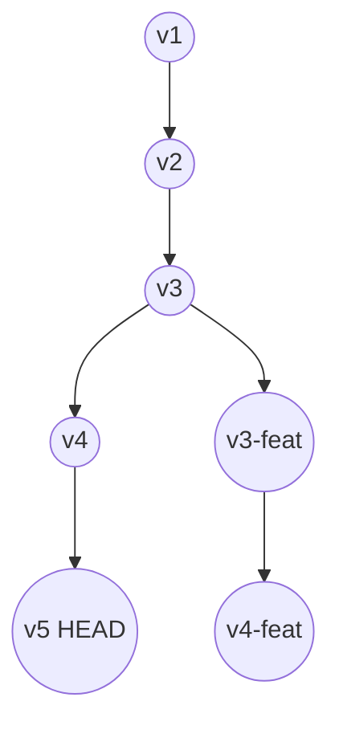

# ⏳ Time-Travel Versioning - Kompletny Przewodnik

System wersjonowania Kamaros pozwala na przywrócenie projektu do dowolnego stanu z historii. W przeciwieństwie do prostych systemów backupu, Kamaros oferuje inteligentne, przyrostowe wersjonowanie z obsługą rozgałęzień (branching).

## 1. Model Wersjonowania DAG

Kamaros, podobnie jak Git, używa **Directed Acyclic Graph (DAG)** do reprezentacji historii.

### 1.1 Struktura Grafu
Każda wersja (commit) to węzeł w grafie, wskazujący na swojego rodzica (lub rodziców w przypadku merge).



### 1.2 Obiekt Wersji (`Version`)

```typescript
interface Version {
  id: string;               // UUID v4
  parentId: string | null;  // null dla initial commit
  parentIds?: string[];     // Dla merge commits (v2+)
  timestamp: string;        // ISO 8601
  message: string;          // Opis zmian
  author: AuthorInfo;
  
  // Stan plików w tej KONKRETNEJ wersji
  fileStates: Map<string, FileState>;
  
  // Statystyki
  stats: {
    filesAdded: number;
    filesModified: number;
    filesDeleted: number;
  };
}
```

**Kluczowa cecha**: `fileStates` zawiera pełną listę plików dla danej wersji. Nie musisz rekonstruować stanu pliku z delty, aby wiedzieć, czy plik istnieje w tej wersji.

## 2. Nawigacja po Historii

### 2.1 Algorytm Budowania Ścieżki (`buildVersionPath`)

Aby przejść z wersji A do wersji B, system musi znaleźć najkrótszą ścieżkę w grafie.

```typescript
function buildVersionPath(currentId: string, targetId: string): VersionPath {
  // 1. Znajdź wspólnego przodka (Lowest Common Ancestor - LCA)
  const lca = findLCA(currentId, targetId);
  
  // 2. Ścieżka "w dół" (revert): Current -> LCA
  // Wymaga aplikowania reverse patches
  const revertPath = getPathToAncestor(currentId, lca);
  
  // 3. Ścieżka "w górę" (apply): LCA -> Target
  // Wymaga forward patches (lub rekonstrukcji z reverse)
  const applyPath = getPathFromAncestor(lca, targetId);
  
  return { revertPath, applyPath };
}
```

## 3. Proces Przywracania Wersji (`restoreVersion`)

Przywracanie wersji to operacja, która zmienia stan Working Directory (`/content/`).

### Krok 1: Weryfikacja
System sprawdza, czy nie ma niezapisanych zmian w Working Directory ("dirty state").
- Jeśli są zmiany → Błąd (użytkownik musi zrobić commit lub stash).

### Krok 2: Ustalenie różnic
Porównujemy `fileStates` z HEAD i Target Version:
1. **Files to modify**: Pliki obecne w obu, ale z innym hashem.
2. **Files to add**: Pliki obecne w Target, brak w HEAD.
3. **Files to delete**: Pliki obecne w HEAD, brak w Target.

### Krok 3: Wykonanie zmian (Atomic-like)

#### A. Modyfikacja plików tekstowych (Tekst)
Dla każdego pliku:
1. Pobierz aktualną zawartość (z `/content/`).
2. Załaduj łańcuch patchy między HEAD a Target.
3. Aplikuj patche sekwencyjnie.
4. Wynik zapisz tymczasowo.

#### B. Przywracanie plików binarnych (CAS)
Dla każdego pliku:
1. Pobierz hash z `fileStates` wersji Target.
2. Sprawdź, czy blob istnieje w `.store/blobs/`.
    - Jeśli brak (np. usunięty przez agresywny GC) → **Critical Error** (Restore niemożliwe).
3. Pobierz zawartość bloba.

#### C. Finalizacja
1. Usuń pliki z listy "to delete".
2. Zapisz nowe/zmodyfikowane pliki do `/content/`.
3. Zaktualizuj `refs.head` w `manifest.json`.
4. Zapisz manifest.

## 4. Obsługa Konfliktów i Branching

Choć MVP skupia się na liniowej historii, struktura jest gotowa na branching.

### 4.1 Merge Strategy (Future)
Gdy łączymy dwa gałęzie (np. `main` i `feature`), może wystąpić konflikt, gdy ten sam plik został zmieniony w obu gałęziach od czasu LCA.

**Algorytm 3-way Merge**:
1. Weź wersję pliku z **Base** (LCA).
2. Weź wersję z **Theirs** (Incoming).
3. Weź wersję z **Yours** (Current).
4. Wygeneruj diff `Base -> Theirs` i `Base -> Yours`.
5. Próbuj połączyć zmiany.
    - Sukces → Auto-merge.
    - Konflikt → Wstaw znaczniki konfliktu (`<<<<<<<`, `=======`, `>>>>>>>`).

## 5. Edge Cases i Rozwiązywanie Problemów

### 5.1 Zmiana Typu Pliku (Binary ↔ Text)
Co jeśli `logo.png` (binary) został zastąpiony przez `logo.txt` (text)?
- System traktuje to jako: **Delete Binary** + **Add Text**.
- Nie próbujemy robić diffa między binarką a tekstem.

### 5.2 "Znikające" Bloby
Jeśli `restoreVersion` napotka brakujący blob (np. usunięty ręcznie):
1. Sprawdź `index.json` czy blob powinien istnieć.
2. Przeszukaj lokalny cache.
3. **Fallback**: Zgłoś błąd `BlobNotFoundError`. Użytkownik nie może przywrócić tej wersji w pełni.

### 5.3 Cykliczne Linki
W DAG cykle nie powinny istnieć. Manifest jest walidowany przy każdym zapisie, aby zapobiec `parentId` wskazującemu na potomka.

## 6. Immutability
Raz zapisana wersja (commit) jest **niezmienna**.
- Nie można zmienić autora, wiadomości ani zawartości plików w istniejącej wersji.
- "Edycja historii" polega na tworzeniu nowych wersji, które zastępują stare (jak `git rebase`).

---
**Zobacz też**:
- [Content Addressable Storage](./04-content-addressing.md) - jak przechowywane są binaria.
- [JCF Format](./01-jcf-format.md) - struktura pliku ZIP.