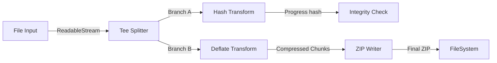
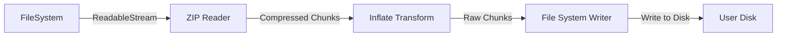

# 🌊 Streaming Architecture - Obsługa Dużych Plików

Architektura Kamaros została zaprojektowana z założeniem "Stream First", co pozwala na obsługę plików o dowolnym rozmiarze (nawet > GB) przy minimalnym zużyciu pamięci RAM.

## 1. Problem: Memory Overflow

W standardowym podejściu (cały plik w pamięci):
- Plik 500MB → Alokacja 500MB ArrayBuffer
- Crash w przeglądarce (limit pamięci tab/worker)
- Blokada UI podczas alokacji/kopiowania

W podejściu Kamaros:
- Plik 500MB → Bufor 64KB (chunk)
- Stałe zużycie pamięci niezależnie od rozmiaru pliku
- Brak blokady UI

## 2. Architektura Przepływu Danych

Kamaros wykorzystuje standard **WHATWG Streams API** (`ReadableStream`, `WritableStream`, `TransformStream`) dostępny w przeglądarkach, Node.js i Deno.

### 2.1 Pipeline: Upload (Save)



### 2.2 Pipeline: Download (Restore)



## 3. Implementacja Techniczna

### 3.1 Interfejs Streams

```typescript
interface FileSystemAdapter {
  // Zamiast Promise<Uint8Array>, zwracamy strumień
  readFileStream(path: string): Promise<ReadableStream<Uint8Array>>;
  
  // Zapis strumieniowy z backpressure
  writeFileStream(path: string, stream: ReadableStream<Uint8Array>): Promise<void>;
}
```

### 3.2 Hashing Stream (SHA-256)

Obliczanie hasha "w locie" bez ładowania całości:

```typescript
async function computeHashFromStream(stream: ReadableStream): Promise<string> {
  const reader = stream.getReader();
  const hasher = crypto.createHash('sha256'); // Node.js lub WebCrypto wrapper
  
  try {
    while (true) {
      const { done, value } = await reader.read();
      if (done) break;
      
      // Update hash state with chunk
      hasher.update(value);
      
      // Bonus: Report progress
      reportProgress(value.length);
    }
  } finally {
    reader.releaseLock();
  }
  
  return hasher.digest('hex');
}
```

### 3.3 Streaming ZIP (fflate modification)

Używamy zmodyfikowanej wersji `fflate`, która wspiera kompresję strumieniową:

```typescript
import { ZipDeflate, AsyncZipDeflate } from 'fflate';

function createZipStream(files: StreamFile[]): ReadableStream {
  // Create ZIP structure on the fly
  const zip = new AsyncZipDeflate(files[0].name, { level: 6 });
  
  files[0].stream.pipeTo(new WritableStream({
    write(chunk) {
      zip.push(chunk, false); // false = not final
    },
    close() {
      zip.push(new Uint8Array(0), true); // true = final
    }
  }));
  
  return zip.stream; // Output stream of ZIP bytes
}
```

## 4. Backpressure i Chunking

### 4.1 Co to jest Backpressure?
Jeśli dysk jest wolniejszy niż sieć (lub odwrotnie), bufor może się przepełnić. Streams API automatycznie obsługuje **backpressure**:
- Jeśli `WritableStream` jest zajęty, sygnał jest wysyłany do `ReadableStream`.
- `ReadableStream` przestaje czytać źródło (pauzuje).
- Pamięć RAM jest bezpieczna.

### 4.2 Rozmiar Chunka (Chunk Size)
Domyślny rozmiar chunka w Kamaros: **64KB**.
- Kompromis między wydajnością (mniej wywołań funkcji) a pamięcią.
- Konfigurowalne w `JCFConfig`.

## 5. Web Workers Integration

Dla maksymalnej wydajności, strumienie mogą być transferowane do Workerów (`Transferable objects`).

```typescript
// Main Thread
const fileStream = file.stream();
worker.postMessage({ stream: fileStream }, [fileStream]);

// Worker Thread
self.onmessage = (e) => {
  const stream = e.data.stream;
  // Process stream in worker (hash, compress)
  // Nie blokuje UI w głównym wątku!
};
```

## 6. Edge Cases

### 6.1 Błędy w trakcie streamu
Jeśli stream zostanie przerwany (np. błąd sieci):
1. `reader.read()` rzuca wyjątek.
2. Pipeline jest przerywany (`abort()`).
3. Tymczasowe pliki (partial uploads) są usuwane (`.store/temp/`).

### 6.2 Anulowanie (Cancellation)
Użytkownik może anulować długi upload:
```typescript
const controller = new AbortController();
await manager.addFile(path, stream, { signal: controller.signal });

// Later...
controller.abort(); // Przerywa strumień natychmiast
```

---
**Zobacz też**:
- [Content Addressable Storage](./04-content-addressing.md) - jak streamujemy do CAS.
- [Workers](./06-workers.md) - offloading obliczeń.