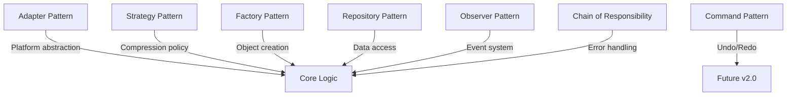

# Design Patterns w Kamaros

> **Wzorce projektowe zastosowane w architekturze biblioteki**

[← Back: Component Interaction](04-component-interaction.md) | [Next: Data Structures →](06-data-structures.md)

---

## Przegląd Wzorców

Kamaros wykorzystuje 7 klasycznych wzorców projektowych do zapewnienia modularności, testowalności i rozszerzalności:



---

## 1. Adapter Pattern 🔌

### Problem
Różne platformy mają różne API dla operacji I/O:
- **Browser**: IndexedDB + File API
- **Node.js**: fs/promises
- **Tauri**: @tauri-apps/api/fs

Jak pisać kod platform-agnostic?

### Rozwiązanie

```typescript
interface FileSystemAdapter {
  readFile(path: string): Promise<Uint8Array>;
  writeFile(path: string, data: Uint8Array): Promise<void>;
  deleteFile(path: string): Promise<void>;
  fileExists(path: string): Promise<boolean>;
  listFiles(directory: string): Promise<string[]>;
}
```

### Implementacje

```typescript
class BrowserAdapter implements FileSystemAdapter {
  private db: IDBDatabase;
  
  async readFile(path: string): Promise<Uint8Array> {
    const transaction = this.db.transaction(['files'], 'readonly');
    const store = transaction.objectStore('files');
    const request = store.get(path);
    
    return new Promise((resolve, reject) => {
      request.onsuccess = () => resolve(request.result?.data);
      request.onerror = () => reject(request.error);
    });
  }
  
  // ... other methods
}

class NodeAdapter implements FileSystemAdapter {
  async readFile(path: string): Promise<Uint8Array> {
    const buffer = await fs.readFile(path);
    return new Uint8Array(buffer);
  }
  
  // ... other methods
}

class TauriAdapter implements FileSystemAdapter {
  async readFile(path: string): Promise<Uint8Array> {
    const contents = await tauriFs.readBinaryFile(path);
    return contents;
  }
  
  // ... other methods
}
```

### Korzyści
- ✅ Core logic platform-agnostic
- ✅ Easy testing (MockAdapter)
- ✅ Future-proof (nowe platformy bez refactoringu core)
- ✅ Separation of concerns

### Lokalizacja
`src/adapters/`

---

## 2. Strategy Pattern 🎯

### Problem
Różne typy plików wymagają różnych strategii kompresji:
- **PNG**: Already compressed → STORE (level 0)
- **JavaScript**: Text → DEFLATE (level 6)
- **ZIP**: Nested compression → STORE (avoid double compression)

### Rozwiązanie

```typescript
interface CompressionStrategy {
  shouldCompress(filepath: string, data: Uint8Array): boolean;
  getLevel(): number;
}

class TextCompressionStrategy implements CompressionStrategy {
  shouldCompress(filepath: string, data: Uint8Array): boolean {
    return this.isTextFile(filepath);
  }
  
  getLevel(): number {
    return 6; // Balance compression vs speed
  }
  
  private isTextFile(filepath: string): boolean {
    const ext = filepath.split('.').pop()?.toLowerCase();
    return ['js', 'ts', 'json', 'txt', 'md', 'html', 'css'].includes(ext!);
  }
}

class ImageCompressionStrategy implements CompressionStrategy {
  shouldCompress(filepath: string, data: Uint8Array): boolean {
    return false; // Images already compressed
  }
  
  getLevel(): number {
    return 0; // STORE
  }
}

class AdaptiveCompressionStrategy implements CompressionStrategy {
  shouldCompress(filepath: string, data: Uint8Array): boolean {
    // Try compressing 1KB sample
    const sample = data.slice(0, 1024);
    const compressed = compressSample(sample);
    
    // If ratio < 0.9, compression is worthwhile
    return compressed.length / sample.length < 0.9;
  }
  
  getLevel(): number {
    return 6;
  }
}
```

### Usage

```typescript
class ZipWriter {
  private strategy: CompressionStrategy;
  
  constructor(strategy: CompressionStrategy) {
    this.strategy = strategy;
  }
  
  async addFile(path: string, data: Uint8Array): Promise<void> {
    const level = this.strategy.shouldCompress(path, data) 
      ? this.strategy.getLevel() 
      : 0;
    
    await this.zip.addFile(path, data, { level });
  }
}
```

### Korzyści
- ✅ Flexible compression policy
- ✅ Easy to add new strategies
- ✅ Testable independently

### Lokalizacja
`src/core/compression/`

---

## 3. Factory Pattern 🏭

### Problem
Tworzenie ZIP readers/writers z różnymi konfiguracjami jest skomplikowane.

### Rozwiązanie

```typescript
class ZipFactory {
  static createWriter(
    adapter: FileSystemAdapter,
    strategy?: CompressionStrategy
  ): ZipWriter {
    const compressionStrategy = strategy ?? new AdaptiveCompressionStrategy();
    return new FflateZipWriter(adapter, compressionStrategy);
  }
  
  static createReader(
    source: Uint8Array | ReadableStream,
    adapter: FileSystemAdapter
  ): ZipReader {
    if (source instanceof ReadableStream) {
      return new StreamingZipReader(source, adapter);
    } else {
      return new BufferedZipReader(source, adapter);
    }
  }
  
  static createStreaming(
    adapter: FileSystemAdapter
  ): StreamingZipWriter {
    return new StreamingZipWriter(adapter);
  }
}
```

### Usage

```typescript
// Simple case
const writer = ZipFactory.createWriter(adapter);

// Custom strategy
const writer = ZipFactory.createWriter(
  adapter,
  new TextCompressionStrategy()
);

// Streaming for large files
const streamWriter = ZipFactory.createStreaming(adapter);
```

### Korzyści
- ✅ Centralized object creation
- ✅ Hides complexity
- ✅ Easy to change implementation

### Lokalizacja
`src/core/zip/ZipFactory.ts`

---

## 4. Repository Pattern 📚

### Problem
Bezpośredni dostęp do adaptera w całym kodzie prowadzi do:
- Duplikacji logiki
- Trudności w testowaniu
- Brak cachingu/optimizacji

### Rozwiązanie

```typescript
class BlobRepository {
  constructor(
    private adapter: FileSystemAdapter,
    private cache: LRUCache<string, Uint8Array>
  ) {}
  
  async save(hash: string, data: Uint8Array): Promise<void> {
    await this.adapter.writeFile(`.store/blobs/${hash}`, data);
    this.cache.set(hash, data);
  }
  
  async load(hash: string): Promise<Uint8Array> {
    // Check cache first
    const cached = this.cache.get(hash);
    if (cached) return cached;
    
    // Load from storage
    const data = await this.adapter.readFile(`.store/blobs/${hash}`);
    this.cache.set(hash, data);
    return data;
  }
  
  async exists(hash: string): Promise<boolean> {
    if (this.cache.has(hash)) return true;
    return await this.adapter.fileExists(`.store/blobs/${hash}`);
  }
  
  async listAll(): Promise<string[]> {
    const files = await this.adapter.listFiles('.store/blobs/');
    return files.map(f => f.replace('.store/blobs/', ''));
  }
}

class DeltaRepository {
  constructor(private adapter: FileSystemAdapter) {}
  
  async save(versionId: string, filePath: string, patchText: string): Promise<void> {
    const filename = `${versionId}_${hashPath(filePath)}.patch`;
    const data = new TextEncoder().encode(patchText);
    await this.adapter.writeFile(`.store/deltas/${filename}`, data);
  }
  
  async load(versionId: string, filePath: string): Promise<string> {
    const filename = `${versionId}_${hashPath(filePath)}.patch`;
    const data = await this.adapter.readFile(`.store/deltas/${filename}`);
    return new TextDecoder().decode(data);
  }
}

class ManifestRepository {
  constructor(private adapter: FileSystemAdapter) {}
  
  async load(): Promise<Manifest> {
    const data = await this.adapter.readFile('manifest.json');
    const json = JSON.parse(new TextDecoder().decode(data));
    return deserializeManifest(json);
  }
  
  async save(manifest: Manifest): Promise<void> {
    const json = serializeManifest(manifest);
    const data = new TextEncoder().encode(json);
    await this.adapter.writeFile('manifest.json', data);
  }
}
```

### Korzyści
- ✅ Centralized data access
- ✅ Easy caching integration
- ✅ Testable with mock repositories
- ✅ Clear responsibility boundaries

### Lokalizacja
`src/repositories/`

---

## 5. Observer Pattern 👁️

### Problem
Jak informować użytkownika o progress długotrwałych operacji (save, restore, GC)?

### Rozwiązanie

```typescript
import { EventEmitter } from 'events';

class JCFManager extends EventEmitter {
  async saveCheckpoint(message: string): Promise<string> {
    this.emit('checkpoint:start', { message, timestamp: Date.now() });
    
    try {
      // Identify changed files
      this.emit('checkpoint:progress', { 
        phase: 'scanning', 
        percent: 10 
      });
      
      const changedFiles = await this.identifyChanges();
      
      // Process files
      this.emit('checkpoint:progress', { 
        phase: 'processing', 
        percent: 30,
        filesTotal: changedFiles.length 
      });
      
      for (let i = 0; i < changedFiles.length; i++) {
        await this.processFile(changedFiles[i]);
        
        this.emit('checkpoint:progress', { 
          phase: 'processing',
          percent: 30 + (i / changedFiles.length) * 50,
          filesDone: i + 1,
          filesTotal: changedFiles.length
        });
      }
      
      // Finalize
      this.emit('checkpoint:progress', { 
        phase: 'finalizing', 
        percent: 90 
      });
      
      const versionId = await this.finalize(message);
      
      this.emit('checkpoint:complete', { 
        versionId, 
        duration: Date.now() - startTime 
      });
      
      return versionId;
      
    } catch (error) {
      this.emit('checkpoint:error', { error });
      throw error;
    }
  }
}
```

### Usage

```typescript
const manager = new JCFManager();

manager.on('checkpoint:start', (e) => {
  console.log(`Starting checkpoint: ${e.message}`);
});

manager.on('checkpoint:progress', (e) => {
  console.log(`Progress: ${e.percent}% (${e.phase})`);
  updateProgressBar(e.percent);
});

manager.on('checkpoint:complete', (e) => {
  console.log(`Checkpoint complete: ${e.versionId} (${e.duration}ms)`);
});

manager.on('checkpoint:error', (e) => {
  console.error(`Error:`, e.error);
});

await manager.saveCheckpoint('Feature: Add login page');
```

### Events

| Event | Data | Description |
|-------|------|-------------|
| `checkpoint:start` | `{ message, timestamp }` | Checkpoint rozpoczęty |
| `checkpoint:progress` | `{ phase, percent, ... }` | Progress update |
| `checkpoint:complete` | `{ versionId, duration }` | Checkpoint zakończony |
| `checkpoint:error` | `{ error }` | Error occurred |
| `restore:start` | `{ versionId }` | Restore rozpoczęty |
| `restore:progress` | `{ percent }` | Restore progress |
| `restore:complete` | `{ versionId }` | Restore zakończony |
| `gc:complete` | `{ report }` | GC zakończone |

### Korzyści
- ✅ Decoupled UI from core logic
- ✅ Real-time feedback
- ✅ Easy to add new listeners

### Lokalizacja
`src/core/JCFManager.ts`

---

## 6. Chain of Responsibility ⛓️

### Problem
Różne typy błędów wymagają różnych strategii obsługi (retry, fallback, throw).

### Rozwiązanie

```typescript
abstract class ErrorHandler {
  protected next?: ErrorHandler;
  
  setNext(handler: ErrorHandler): ErrorHandler {
    this.next = handler;
    return handler;
  }
  
  handle(error: Error, context: ErrorContext): void {
    if (this.canHandle(error)) {
      this.process(error, context);
    } else if (this.next) {
      this.next.handle(error, context);
    } else {
      throw error; // Unhandled
    }
  }
  
  protected abstract canHandle(error: Error): boolean;
  protected abstract process(error: Error, context: ErrorContext): void;
}

class StorageErrorHandler extends ErrorHandler {
  canHandle(error: Error): boolean {
    return error instanceof StorageError;
  }
  
  process(error: StorageError, context: ErrorContext): void {
    console.warn('Storage error, retrying...', error);
    
    // Retry up to 3 times
    if (context.retryCount < 3) {
      context.retryCount++;
      setTimeout(() => context.retry(), 1000 * context.retryCount);
    } else {
      throw new Error('Storage error after 3 retries', { cause: error });
    }
  }
}

class NetworkErrorHandler extends ErrorHandler {
  canHandle(error: Error): boolean {
    return error instanceof NetworkError;
  }
  
  process(error: NetworkError, context: ErrorContext): void {
    console.warn('Network error, using cache...', error);
    context.useCachedData();
  }
}

class ValidationErrorHandler extends ErrorHandler {
  canHandle(error: Error): boolean {
    return error instanceof ValidationError;
  }
  
  process(error: ValidationError, context: ErrorContext): void {
    console.error('Validation failed:', error.details);
    throw error; // Can't recover
  }
}
```

### Setup

```typescript
const errorChain = new StorageErrorHandler();
errorChain
  .setNext(new NetworkErrorHandler())
  .setNext(new ValidationErrorHandler());

// Usage
try {
  await operation();
} catch (error) {
  errorChain.handle(error, context);
}
```

### Korzyści
- ✅ Flexible error handling
- ✅ Easy to add new handlers
- ✅ Single Responsibility Principle

### Lokalizacja
`src/core/errors/`

---

## 7. Command Pattern 📝

### Problem
Jak implementować Undo/Redo? (Future feature)

### Rozwiązanie

```typescript
interface Command {
  execute(): Promise<void>;
  undo(): Promise<void>;
  canUndo(): boolean;
}

class AddFileCommand implements Command {
  constructor(
    private manager: JCFManager,
    private path: string,
    private content: Uint8Array,
    private metadata?: FileMetadata
  ) {}
  
  async execute(): Promise<void> {
    await this.manager.addFile(this.path, this.content, this.metadata);
  }
  
  async undo(): Promise<void> {
    await this.manager.deleteFile(this.path);
  }
  
  canUndo(): boolean {
    return true;
  }
}

class DeleteFileCommand implements Command {
  private previousContent?: Uint8Array;
  
  constructor(
    private manager: JCFManager,
    private path: string
  ) {}
  
  async execute(): Promise<void> {
    // Save for undo
    this.previousContent = await this.manager.getFile(this.path);
    await this.manager.deleteFile(this.path);
  }
  
  async undo(): Promise<void> {
    if (!this.previousContent) {
      throw new Error('Cannot undo: no previous content');
    }
    await this.manager.addFile(this.path, this.previousContent);
  }
  
  canUndo(): boolean {
    return this.previousContent !== undefined;
  }
}

class CommandManager {
  private history: Command[] = [];
  private currentIndex = -1;
  
  async execute(command: Command): Promise<void> {
    await command.execute();
    
    // Truncate forward history
    this.history = this.history.slice(0, this.currentIndex + 1);
    
    this.history.push(command);
    this.currentIndex++;
  }
  
  async undo(): Promise<void> {
    if (this.currentIndex < 0) {
      throw new Error('Nothing to undo');
    }
    
    const command = this.history[this.currentIndex];
    if (!command.canUndo()) {
      throw new Error('Command cannot be undone');
    }
    
    await command.undo();
    this.currentIndex--;
  }
  
  async redo(): Promise<void> {
    if (this.currentIndex >= this.history.length - 1) {
      throw new Error('Nothing to redo');
    }
    
    this.currentIndex++;
    const command = this.history[this.currentIndex];
    await command.execute();
  }
  
  canUndo(): boolean {
    return this.currentIndex >= 0;
  }
  
  canRedo(): boolean {
    return this.currentIndex < this.history.length - 1;
  }
}
```

### Usage

```typescript
const commandManager = new CommandManager();

// Execute commands
await commandManager.execute(
  new AddFileCommand(manager, 'index.js', data)
);

await commandManager.execute(
  new DeleteFileCommand(manager, 'old.js')
);

// Undo
await commandManager.undo(); // Restore old.js

// Redo
await commandManager.redo(); // Delete old.js again
```

### Status
⚠️ **Future v2.0** - Not implemented in v1.0

### Lokalizacja
`src/commands/` (future)

---

## Podsumowanie Wzorców

| Pattern | Purpose | Status | Lokalizacja |
|---------|---------|--------|-------------|
| **Adapter** | Platform abstraction | ✅ v1.0 | `src/adapters/` |
| **Strategy** | Compression policy | ✅ v1.0 | `src/core/compression/` |
| **Factory** | Object creation | ✅ v1.0 | `src/core/zip/` |
| **Repository** | Data access layer | ✅ v1.0 | `src/repositories/` |
| **Observer** | Event system | ✅ v1.0 | `src/core/JCFManager.ts` |
| **Chain of Responsibility** | Error handling | ✅ v1.0 | `src/core/errors/` |
| **Command** | Undo/Redo | ⚠️ v2.0 | `src/commands/` (future) |

---

## Dlaczego Te Wzorce?

### Testability
Każdy wzorzec ułatwia unit testing poprzez dependency injection i mocki.

### Maintainability
Separation of concerns - każda klasa ma jasną odpowiedzialność.

### Extensibility
Łatwo dodawać nowe implementacje (adaptery, strategie, handlery) bez modyfikacji core logic.

### Industry Standard
Sprawdzone wzorce używane w produkcyjnych systemach.

---

[← Back: Component Interaction](04-component-interaction.md) | [Next: Data Structures →](06-data-structures.md)

