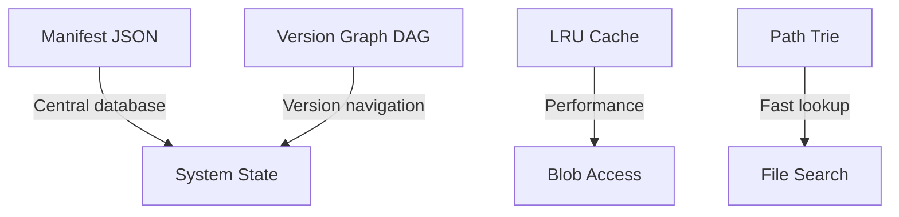

# Data Structures w Kamaros

> **Kluczowe struktury danych i uzasadnienie wyborów**

[← Back: Design Patterns](05-design-patterns.md) | [Up to Architecture](01-system-overview.md)

---

## Przegląd Struktur

Kamaros wykorzystuje specjalistyczne struktury danych zoptymalizowane pod konkretne use cases:



---

## 1. Manifest (Central Database)

### Struktura

```typescript
interface Manifest {
  formatVersion: string;              // "1.0.0"
  metadata: ProjectMetadata;          // Author, created, modified
  fileMap: Map<string, FileEntry>;    // Fast lookup by path
  versionHistory: Version[];          // Append-only log
  refs: Map<string, string>;          // head, branches (future)
  renameLog: RenameEntry[];           // Track renames
}

interface ProjectMetadata {
  name: string;
  author: string;
  created: string;        // ISO 8601
  lastModified: string;   // ISO 8601
  description?: string;
}

interface FileEntry {
  inodeId: string;        // Unique ID (never changes)
  type: 'text' | 'binary';
  currentHash?: string;   // For binaries
  created: string;
  modified: string;
}

interface Version {
  id: string;             // UUID v4
  parentId: string | null;
  timestamp: string;      // ISO 8601
  message: string;
  author: string;
  fileStates: Map<string, FileState>;
}

interface FileState {
  inodeId: string;
  hash?: string;          // For binaries
  contentRef?: string;    // For deltas
  deleted?: boolean;
}

interface RenameEntry {
  inodeId: string;
  fromPath: string;
  toPath: string;
  versionId: string;
  timestamp: string;
}
```

### Dlaczego Map zamiast Object?

**Comparison**:

| Feature | Object | Map | Winner |
|---------|--------|-----|--------|
| **Iteration order** | Not guaranteed (pre-ES2015) | Guaranteed insertion order | Map |
| **Key types** | Only strings/symbols | Any type | Map |
| **Size property** | Manual (Object.keys().length) | Built-in .size | Map |
| **Performance (>100 keys)** | Varies | Optimized for frequent add/remove | Map |
| **Clear operation** | delete props manually | .clear() | Map |
| **Serialization** | JSON.stringify() direct | Needs conversion | Object |

**Decision**: Map dla features + performance, z konwersją do Object przy serializacji.

### Serializacja

```typescript
function serializeManifest(manifest: Manifest): string {
  return JSON.stringify({
    ...manifest,
    fileMap: Object.fromEntries(manifest.fileMap),
    refs: Object.fromEntries(manifest.refs),
    versionHistory: manifest.versionHistory.map(v => ({
      ...v,
      fileStates: Object.fromEntries(v.fileStates)
    }))
  }, null, 2);
}

function deserializeManifest(json: any): Manifest {
  return {
    ...json,
    fileMap: new Map(Object.entries(json.fileMap)),
    refs: new Map(Object.entries(json.refs)),
    versionHistory: json.versionHistory.map((v: any) => ({
      ...v,
      fileStates: new Map(Object.entries(v.fileStates))
    }))
  };
}
```

---

## 2. Version Graph (DAG)

### Problem
Jak nawigować po historii wersji i znajdować ścieżki między wersjami?

### Struktura

```
v1 (root)
 │
 ├─ v2
 │   │
 │   ├─ v3
 │   │   │
 │   │   └─ v5 (HEAD)
 │   │
 │   └─ v4 (branch)
 │
 └─ v6 (orphaned - candidate for GC)
```

### Reprezentacja

```typescript
interface VersionNode {
  id: string;
  parentId: string | null;
  children: string[];
}

class VersionGraph {
  private nodes = new Map<string, VersionNode>();
  
  addVersion(version: Version): void {
    const node: VersionNode = {
      id: version.id,
      parentId: version.parentId,
      children: []
    };
    
    this.nodes.set(version.id, node);
    
    // Update parent's children
    if (version.parentId) {
      const parent = this.nodes.get(version.parentId);
      if (parent) {
        parent.children.push(version.id);
      }
    }
  }
  
  /**
   * Find path from current to target (going backwards via parents)
   * Example: HEAD=v5, target=v1 → [v5, v3, v2, v1]
   */
  findPath(fromId: string, toId: string): string[] {
    const queue: Array<{id: string, path: string[]}> = [
      { id: fromId, path: [fromId] }
    ];
    const visited = new Set<string>();
    
    while (queue.length > 0) {
      const { id, path } = queue.shift()!;
      
      if (id === toId) {
        return path;
      }
      
      if (visited.has(id)) continue;
      visited.add(id);
      
      const node = this.nodes.get(id);
      if (node?.parentId) {
        queue.push({
          id: node.parentId,
          path: [...path, node.parentId]
        });
      }
    }
    
    throw new Error(`No path found from ${fromId} to ${toId}`);
  }
  
  /**
   * Find common ancestor of two versions
   * Used for: merge conflict detection (future)
   */
  findCommonAncestor(id1: string, id2: string): string | null {
    const ancestors1 = this.getAncestors(id1);
    const ancestors2 = this.getAncestors(id2);
    
    // Find first common ancestor
    for (const ancestor of ancestors1) {
      if (ancestors2.has(ancestor)) {
        return ancestor;
      }
    }
    
    return null;
  }
  
  private getAncestors(id: string): Set<string> {
    const ancestors = new Set<string>();
    let currentId: string | null = id;
    
    while (currentId) {
      ancestors.add(currentId);
      const node = this.nodes.get(currentId);
      currentId = node?.parentId ?? null;
    }
    
    return ancestors;
  }
  
  /**
   * Find orphaned versions (no path to HEAD)
   * Used for: Garbage Collection
   */
  findOrphans(headId: string): string[] {
    const reachable = this.getAncestors(headId);
    const orphans: string[] = [];
    
    for (const [id] of this.nodes) {
      if (!reachable.has(id)) {
        orphans.push(id);
      }
    }
    
    return orphans;
  }
}
```

### Complexity

| Operation | Time | Space | Note |
|-----------|------|-------|------|
| `addVersion` | O(1) | O(1) | Simple map operations |
| `findPath` | O(V) | O(V) | BFS, worst case all versions |
| `findCommonAncestor` | O(V) | O(V) | Two ancestor walks |
| `findOrphans` | O(V) | O(V) | Single traversal |

gdzie V = liczba wersji

---

## 3. LRU Cache (dla Blobów)

### Problem
Frequently accessed blobs powinny być w pamięci, ale pamięć jest ograniczona.

### Rozwiązanie: LRU (Least Recently Used)

```typescript
class LRUCache<K, V> {
  private cache = new Map<K, V>();
  private maxSize: number;
  
  constructor(maxSize: number) {
    this.maxSize = maxSize;
  }
  
  get(key: K): V | undefined {
    const value = this.cache.get(key);
    
    if (value !== undefined) {
      // Move to end (most recently used)
      // Map maintains insertion order
      this.cache.delete(key);
      this.cache.set(key, value);
    }
    
    return value;
  }
  
  set(key: K, value: V): void {
    // Remove if exists (to reorder)
    this.cache.delete(key);
    
    // Add to end
    this.cache.set(key, value);
    
    // Evict oldest if over limit
    if (this.cache.size > this.maxSize) {
      // First key is oldest (LRU)
      const firstKey = this.cache.keys().next().value;
      this.cache.delete(firstKey);
    }
  }
  
  has(key: K): boolean {
    return this.cache.has(key);
  }
  
  clear(): void {
    this.cache.clear();
  }
  
  get size(): number {
    return this.cache.size;
  }
}
```

### Usage

```typescript
class BlobManager {
  private cache = new LRUCache<string, Uint8Array>(100); // 100 blobs
  
  async loadBlob(hash: string): Promise<Uint8Array> {
    // Check cache first
    const cached = this.cache.get(hash);
    if (cached) {
      console.log('Cache hit:', hash);
      return cached;
    }
    
    // Load from storage
    console.log('Cache miss:', hash);
    const data = await this.repository.load(hash);
    
    // Store in cache
    this.cache.set(hash, data);
    
    return data;
  }
}
```

### Dlaczego LRU zamiast LFU?

| Algorithm | Pros | Cons | Use Case |
|-----------|------|------|----------|
| **LRU** | Simple O(1) ops | Doesn't track frequency | Temporal locality |
| **LFU** | Tracks frequency | Complex O(log n) | Access patterns |
| **FIFO** | Simplest | No intelligence | Basic eviction |

**Decision**: LRU - temporal locality (często edytowane pliki używane wielokrotnie w krótkim czasie)

### Complexity

| Operation | Time | Space |
|-----------|------|-------|
| `get` | O(1) | - |
| `set` | O(1) | O(n) |
| `eviction` | O(1) | - |

---

## 4. Path Trie (Optimization)

### Problem
Szybkie wyszukiwanie plików po prefiksie (autocomplete, wildcard search).

### Struktura

```
Files:
- src/index.js
- src/utils.js
- src/components/Button.jsx
- src/components/Input.jsx

Trie:
root
 └─ src/
     ├─ index.js (leaf)
     ├─ utils.js (leaf)
     └─ components/
         ├─ Button.jsx (leaf)
         └─ Input.jsx (leaf)
```

### Implementacja

```typescript
class TrieNode {
  children = new Map<string, TrieNode>();
  data: FileEntry | null = null;
  isLeaf = false;
}

class PathTrie {
  private root = new TrieNode();
  
  /**
   * Insert file path into trie
   * O(L) where L = path length
   */
  insert(path: string, data: FileEntry): void {
    const parts = path.split('/');
    let node = this.root;
    
    for (const part of parts) {
      if (!node.children.has(part)) {
        node.children.set(part, new TrieNode());
      }
      node = node.children.get(part)!;
    }
    
    node.data = data;
    node.isLeaf = true;
  }
  
  /**
   * Search for exact path
   * O(L) where L = path length
   */
  search(path: string): FileEntry | null {
    const parts = path.split('/');
    let node = this.root;
    
    for (const part of parts) {
      node = node.children.get(part);
      if (!node) return null;
    }
    
    return node.isLeaf ? node.data : null;
  }
  
  /**
   * Find all paths with given prefix
   * O(P + N) where P = prefix length, N = results
   */
  findByPrefix(prefix: string): string[] {
    const parts = prefix.split('/').filter(p => p);
    let node = this.root;
    
    // Navigate to prefix node
    for (const part of parts) {
      node = node.children.get(part);
      if (!node) return [];
    }
    
    // Collect all paths from this node
    const results: string[] = [];
    this.collectPaths(node, prefix, results);
    return results;
  }
  
  private collectPaths(
    node: TrieNode, 
    currentPath: string, 
    results: string[]
  ): void {
    if (node.isLeaf) {
      results.push(currentPath);
    }
    
    for (const [part, child] of node.children) {
      const nextPath = currentPath ? `${currentPath}/${part}` : part;
      this.collectPaths(child, nextPath, results);
    }
  }
  
  /**
   * Delete path from trie
   * O(L) where L = path length
   */
  delete(path: string): boolean {
    const parts = path.split('/');
    return this.deleteRecursive(this.root, parts, 0);
  }
  
  private deleteRecursive(
    node: TrieNode, 
    parts: string[], 
    index: number
  ): boolean {
    if (index === parts.length) {
      if (!node.isLeaf) return false;
      
      node.isLeaf = false;
      node.data = null;
      
      // If no children, this node can be deleted
      return node.children.size === 0;
    }
    
    const part = parts[index];
    const child = node.children.get(part);
    if (!child) return false;
    
    const shouldDeleteChild = this.deleteRecursive(child, parts, index + 1);
    
    if (shouldDeleteChild) {
      node.children.delete(part);
      return node.children.size === 0 && !node.isLeaf;
    }
    
    return false;
  }
}
```

### Usage

```typescript
class FileManager {
  private trie = new PathTrie();
  
  addFile(path: string, entry: FileEntry): void {
    this.trie.insert(path, entry);
  }
  
  findFile(path: string): FileEntry | null {
    return this.trie.search(path);
  }
  
  // Autocomplete
  autocomplete(prefix: string): string[] {
    return this.trie.findByPrefix(prefix).slice(0, 10); // Top 10
  }
  
  // Wildcard search: src/components/*
  findInDirectory(directory: string): string[] {
    return this.trie.findByPrefix(directory);
  }
}
```

### Status

⚠️ **Optional Optimization** - Not in v1.0 MVP

V1.0 używa prostego Map lookup (O(1) dla exact match). Trie jest przydatne dopiero przy:
- Autocomplete
- Wildcard search
- Directory listing (które i tak robimy rzadko)

---

## 5. Set (dla GC)

### Problem
Garbage Collection potrzebuje szybkiej operacji "is this hash used?"

### Rozwiązanie: Set

```typescript
class GarbageCollector {
  async runGC(): Promise<GCReport> {
    // MARK phase: Collect used hashes
    const usedBlobs = new Set<string>();
    const usedDeltas = new Set<string>();
    
    for (const version of this.manifest.versionHistory) {
      for (const [path, fileState] of version.fileStates) {
        if (fileState.hash) {
          usedBlobs.add(fileState.hash);
        }
        if (fileState.contentRef) {
          usedDeltas.add(fileState.contentRef);
        }
      }
    }
    
    // SWEEP phase: Find orphans
    const allBlobs = await this.listAllBlobs();
    const orphanedBlobs = allBlobs.filter(hash => !usedBlobs.has(hash));
    
    // DELETE phase
    for (const hash of orphanedBlobs) {
      await this.deleteBlob(hash);
    }
    
    return {
      blobsRemoved: orphanedBlobs.length,
      spaceFreed: calculateSize(orphanedBlobs)
    };
  }
}
```

### Dlaczego Set zamiast Array?

| Operation | Array | Set | Winner |
|-----------|-------|-----|--------|
| `.has(value)` | O(n) | O(1) | Set |
| `.add(value)` | O(1) | O(1) | Tie |
| Duplicates | Allowed | Prevented | Set (feature!) |
| Order | Preserved | Insertion order | Tie |
| Memory | Lower | Slightly higher | Array |

**Decision**: Set dla O(1) lookup (critical dla GC z tysiącami hashów)

---

## Podsumowanie Struktur

| Structure | Purpose | Complexity | Status |
|-----------|---------|------------|--------|
| **Manifest** | Central database | O(1) lookup | ✅ v1.0 |
| **Version Graph** | Version navigation | O(V) traversal | ✅ v1.0 |
| **LRU Cache** | Blob caching | O(1) get/set | ✅ v1.0 |
| **Path Trie** | Prefix search | O(L) search | ⚠️ Future |
| **Set** | GC mark phase | O(1) lookup | ✅ v1.0 |

---

## Design Principles

### 1. Choose Data Structure by Access Pattern
- Frequent random access → Map/Set (O(1))
- Sequential iteration → Array
- Prefix search → Trie
- FIFO → Queue
- LIFO → Stack

### 2. Optimize for Common Case
- 95% operacji to dodawanie/odczyt plików → Map (O(1))
- GC rzadko, ale potrzebuje szybkiego lookup → Set
- Autocomplete nice-to-have → Trie (future)

### 3. Measure Before Optimizing
PathTrie nie w v1.0 bo:
- Map wystarczy dla MVP
- Trie dodaje complexity
- Można dodać później bez breaking changes

---

[← Back: Design Patterns](05-design-patterns.md) | [Up to Architecture](01-system-overview.md)


