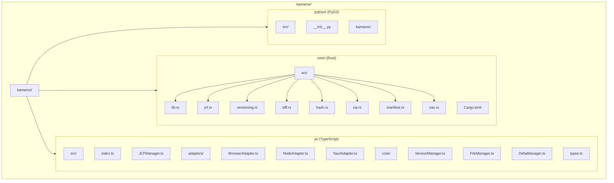
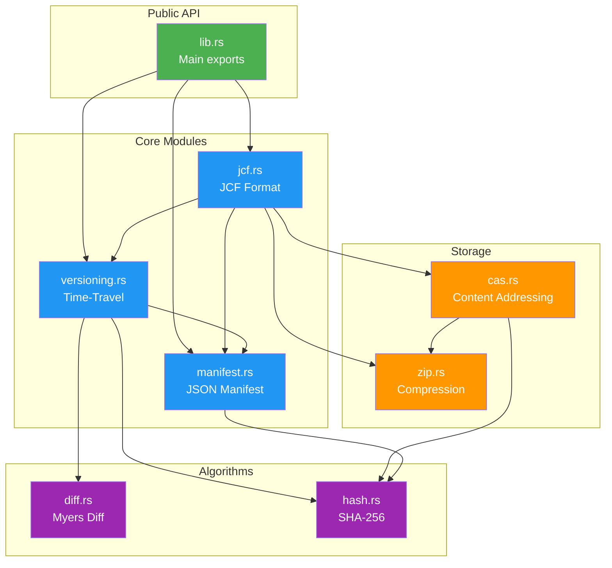
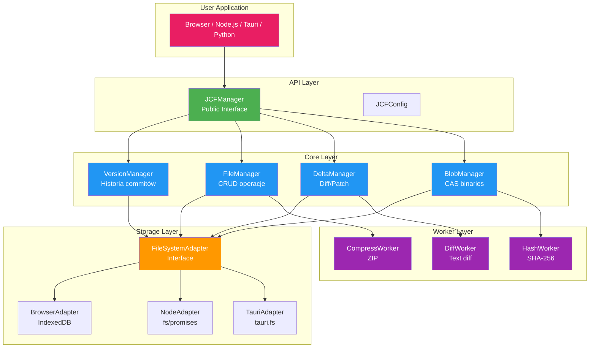
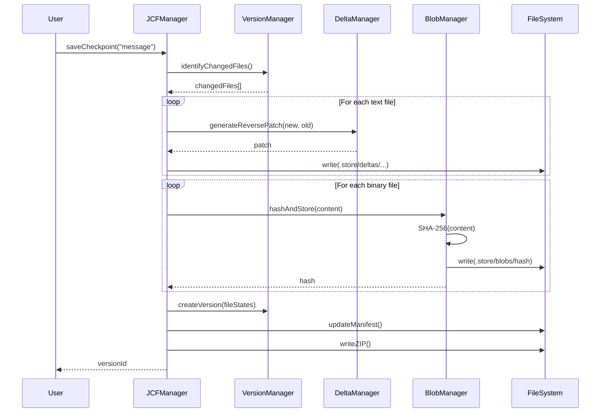
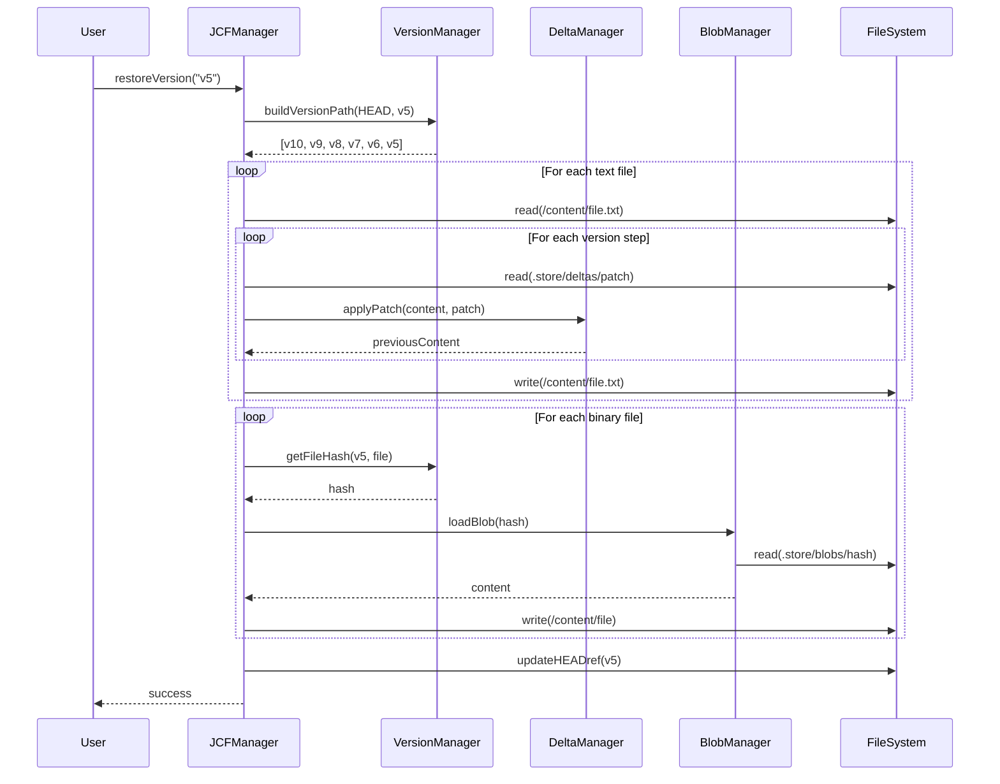
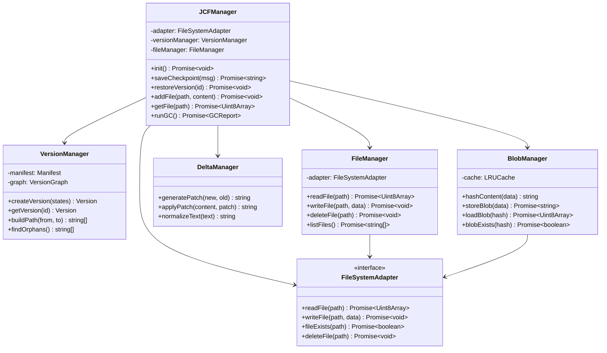
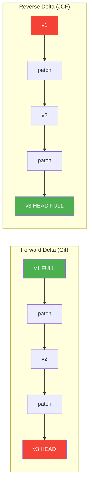
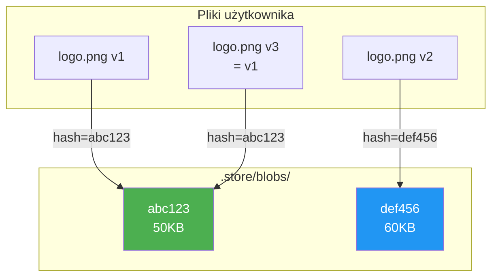
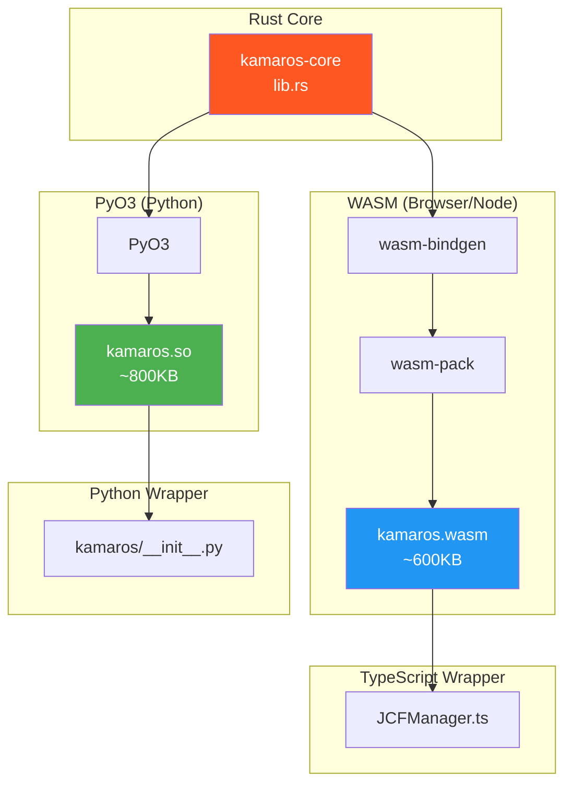

# Wizualizacja Architektury Kamaros

> **Diagramy Mermaid przedstawiające strukturę projektu, przepływy danych i zależności modułów**

---

## 1. Struktura Projektu (Drzewo plików)



---

## 2. Graf Zależności Modułów (Rust Core)



---

## 3. Architektura Warstwowa



---

## 4. Przepływ Danych: Save Checkpoint



---

## 5. Przepływ Danych: Restore Version



---

## 6. Struktura Pliku JCF (ZIP)

```mermaid
graph TD
    subgraph "project.jcf (ZIP Archive)"
        MT[mimetype<br/>"application/x-jcf"]
        MF[manifest.json<br/>Metadane + Historia]
        
        subgraph CONTENT["/content/ (HEAD)"]
            C1[src/index.js]
            C2[src/styles.css]
            C3[assets/logo.png]
        end
        
        subgraph STORE["/.store/ (Historia)"]
            subgraph BLOBS["/blobs/ (CAS)"]
                B1[a3f5e8d9...]
                B2[9d4c1e2b...]
            end
            
            subgraph DELTAS["/deltas/"]
                D1[v5_src_index.js.patch]
                D2[v4_src_index.js.patch]
            end
        end
    end
    
    style MT fill:#4CAF50,color:#fff
    style MF fill:#2196F3,color:#fff
    style CONTENT fill:#E8F5E9
    style STORE fill:#FFF3E0
    style BLOBS fill:#FFECB3
    style DELTAS fill:#FFECB3
```

---

## 7. Główne Klasy i Interfejsy



---

## 8. Strategia Reverse Delta



**Legenda:**
- 🟢 Szybki dostęp (pełna zawartość)
- 🔴 Wolny dostęp (wymaga rekonstrukcji)

---

## 9. Content Addressable Storage (CAS)



**Deduplikacja:** v1 i v3 wskazują na ten sam blob!

---

## 10. FFI Bindings (Rust → Languages)



---

## Powiązane dokumenty

- [System Overview](01-system-overview.md) - Opis architektury
- [Design Patterns](05-design-patterns.md) - Wzorce projektowe
- [Data Structures](06-data-structures.md) - Struktury danych
