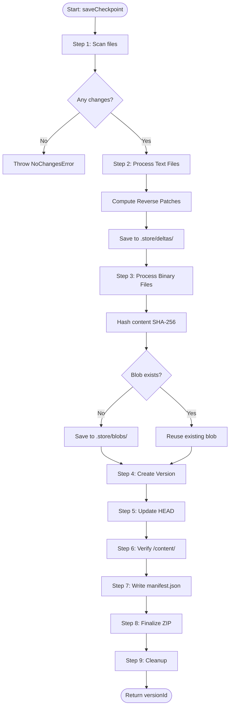

# Save Checkpoint Algorithm

> **Szczegółowy algorytm zapisu nowej wersji (checkpoint/commit)**

[← Back to Technical Decisions](../04-technical-decisions/06-performance-rationale.md) | [Next: Restore Version →](02-restore-version.md)

---

## Overview

Algorytm `saveCheckpoint` jest sercem systemu wersjonowania. Jego zadanie:
1. Wykryć zmienione pliki
2. Wygenerować reverse patches dla tekstów
3. Zadeduplikować binaria (CAS)
4. Utworzyć nowy Version object
5. Zaktualizować manifest i ZIP

---

## Algorithm: Step-by-Step

```
INPUT: 
  - message: string        // User's commit message
  - author: string         // Author name

OUTPUT:
  - versionId: string      // UUID of new version

PRECONDITION:
  - Manager is initialized
  - Working copy has changes

POSTCONDITION:
  - New version created
  - HEAD pointer updated
  - ZIP file contains new state
```

### Step 1: Identify Changed Files

**Purpose**: Determine which files were added, modified, or deleted since last checkpoint.

```typescript
async identifyChanges(): Promise<FileChange[]> {
  const currentFiles = await this.listWorkingCopyFiles();
  const headVersion = this.getVersion(this.manifest.refs.get('head')!);
  const headFiles = new Set(headVersion.fileStates.keys());
  
  const changes: FileChange[] = [];
  
  // Check for added/modified files
  for (const path of currentFiles) {
    const currentHash = await this.hashFile(path);
    const headFileState = headVersion.fileStates.get(path);
    
    if (!headFileState) {
      // New file
      changes.push({
        path,
        type: 'added',
        currentHash
      });
    } else if (headFileState.hash !== currentHash) {
      // Modified file
      changes.push({
        path,
        type: 'modified',
        oldHash: headFileState.hash,
        currentHash
      });
    }
  }
  
  // Check for deleted files
  for (const path of headFiles) {
    if (!currentFiles.includes(path)) {
      changes.push({
        path,
        type: 'deleted'
      });
    }
  }
  
  return changes;
}
```

**Complexity**: O(F × H) gdzie F = files, H = hash time

**Optimization**: Parallel hashing w Web Workers

---

### Step 2: Process Text Files (Reverse Delta)

**Purpose**: Create reverse patches (NEW → OLD) for text files.

```typescript
async processTextFiles(changes: FileChange[]): Promise<void> {
  const textChanges = changes.filter(c => 
    this.manifest.fileMap.get(c.path)?.type === 'text'
  );
  
  for (const change of textChanges) {
    if (change.type === 'deleted') continue;
    
    // Read NEW content (working copy)
    const newContent = await this.adapter.readFile(
      `content/${change.path}`
    );
    const newText = new TextDecoder().decode(newContent);
    
    // Read OLD content (HEAD version)
    let oldText = '';
    if (change.type === 'modified') {
      const oldContent = await this.getFileFromVersion(
        change.path,
        this.manifest.refs.get('head')!
      );
      oldText = new TextDecoder().decode(oldContent);
    }
    
    // Compute REVERSE patch: NEW → OLD
    const reversePatch = await this.deltaManager.computeDelta(
      newText,  // from
      oldText   // to
    );
    
    // Save patch
    await this.deltaManager.saveDelta(
      this.manifest.refs.get('head')!,  // current HEAD
      change.path,
      reversePatch
    );
    
    this.emit('checkpoint:progress', {
      phase: 'diffing',
      file: change.path,
      percent: calculatePercent()
    });
  }
}
```

**Why Reverse?**
- HEAD access: O(1) - just read `/content/`
- Old version access: O(n) - apply n patches backwards
- 95% of time users work with HEAD → optimize for common case

**Complexity**: O(F × L) gdzie F = text files, L = avg file length

---

### Step 3: Process Binary Files (CAS)

**Purpose**: Save binaries to Content Addressable Storage with deduplication.

```typescript
async processBinaryFiles(changes: FileChange[]): Promise<void> {
  const binaryChanges = changes.filter(c => 
    this.manifest.fileMap.get(c.path)?.type === 'binary'
  );
  
  for (const change of binaryChanges) {
    if (change.type === 'deleted') continue;
    
    // Read NEW content
    const content = await this.adapter.readFile(
      `content/${change.path}`
    );
    
    // Hash content (SHA-256)
    const hash = await this.blobManager.hashContent(content);
    
    // Check if different from HEAD
    if (change.type === 'modified' && change.oldHash === hash) {
      continue; // No change in content
    }
    
    // Check if blob already exists (deduplication!)
    const exists = await this.blobManager.blobExists(hash);
    
    if (!exists) {
      // Save new blob
      await this.blobManager.saveBlob(content);
      
      this.emit('checkpoint:progress', {
        phase: 'saving-blobs',
        file: change.path,
        hash,
        size: content.length
      });
    } else {
      this.emit('checkpoint:progress', {
        phase: 'deduplication',
        file: change.path,
        hash,
        saved: content.length  // Space saved!
      });
    }
    
    // Update fileMap
    const fileEntry = this.manifest.fileMap.get(change.path)!;
    fileEntry.currentHash = hash;
    fileEntry.modified = new Date().toISOString();
  }
}
```

**Deduplication Example**:
```
logo.png added in v1 → hash abc123 → save blob
logo.png unchanged in v2-v9 → no new blob
logo.png reverted to v1 in v10 → hash abc123 → blob exists, reuse!
```

**Complexity**: O(F × (H + S)) gdzie F = binary files, H = hash time, S = save time

---

### Step 4: Create New Version Object

**Purpose**: Record snapshot of project state.

```typescript
async createVersion(
  message: string,
  author: string,
  changes: FileChange[]
): Promise<Version> {
  const versionId = uuidv4();
  const parentId = this.manifest.refs.get('head') || null;
  
  // Copy parent's fileStates
  const parentVersion = parentId ? this.getVersion(parentId) : null;
  const fileStates = parentVersion 
    ? new Map(parentVersion.fileStates) 
    : new Map();
  
  // Apply changes
  for (const change of changes) {
    const fileEntry = this.manifest.fileMap.get(change.path);
    
    if (change.type === 'deleted') {
      fileStates.set(change.path, {
        inodeId: fileEntry!.inodeId,
        deleted: true
      });
    } else {
      fileStates.set(change.path, {
        inodeId: fileEntry!.inodeId,
        hash: fileEntry!.currentHash,
        contentRef: fileEntry!.type === 'text' 
          ? `.store/deltas/${versionId}_${hashPath(change.path)}.patch`
          : undefined
      });
    }
  }
  
  const version: Version = {
    id: versionId,
    parentId,
    timestamp: new Date().toISOString(),
    message,
    author,
    fileStates
  };
  
  // Add to history
  this.manifest.versionHistory.push(version);
  
  return version;
}
```

---

### Step 5: Update References

**Purpose**: Move HEAD pointer to new version.

```typescript
updateReferences(versionId: string): void {
  this.manifest.refs.set('head', versionId);
  this.manifest.metadata.lastModified = new Date().toISOString();
}
```

---

### Step 6: Update Working Copy

**Purpose**: Ensure `/content/` reflects current state.

```typescript
async updateWorkingCopy(changes: FileChange[]): Promise<void> {
  // Working copy is already updated (user made changes there)
  // Just verify integrity
  
  for (const change of changes) {
    if (change.type === 'deleted') {
      // Ensure file is removed from /content/
      const exists = await this.adapter.fileExists(`content/${change.path}`);
      if (exists) {
        await this.adapter.deleteFile(`content/${change.path}`);
      }
    }
  }
}
```

**Note**: `/content/` zawsze reprezentuje HEAD. To jest key feature JCF - standard unzip tools mogą odzyskać latest state.

---

### Step 7: Write Manifest

**Purpose**: Persist metadata changes.

```typescript
async writeManifest(): Promise<void> {
  const json = serializeManifest(this.manifest);
  const data = new TextEncoder().encode(json);
  
  // Compress manifest (DEFLATE level 6)
  const compressed = await compress(data, { level: 6 });
  
  // Write to ZIP
  await this.zipWriter.updateFile('manifest.json', compressed);
  
  this.emit('checkpoint:progress', {
    phase: 'writing-manifest',
    size: compressed.length
  });
}
```

---

### Step 8: Finalize ZIP

**Purpose**: Ensure ZIP structure is correct.

```typescript
async finalizeZip(): Promise<void> {
  // Verify /mimetype is first and STORE
  await this.zipWriter.ensureMimetypeFirst();
  
  // Close ZIP stream
  await this.zipWriter.close();
  
  // Write to adapter
  await this.adapter.writeFile(
    this.projectPath,
    this.zipWriter.getBuffer()
  );
  
  this.emit('checkpoint:progress', {
    phase: 'finalizing',
    percent: 100
  });
}
```

---

### Step 9: Cleanup & Emit Events

**Purpose**: Clean up temporary state and notify listeners.

```typescript
cleanup(versionId: string): void {
  // Clear dirty files tracking
  this.dirtyFiles.clear();
  
  // Update internal state
  this.currentVersionId = versionId;
  
  // Emit completion event
  this.emit('checkpoint:complete', {
    versionId,
    timestamp: new Date().toISOString(),
    message: this.lastCommitMessage
  });
}
```

---

## Complete Algorithm

```typescript
async saveCheckpoint(message: string, author?: string): Promise<string> {
  const startTime = Date.now();
  
  try {
    this.emit('checkpoint:start', { message });
    
    // Step 1: Identify changes
    this.emit('checkpoint:progress', { phase: 'scanning', percent: 10 });
    const changes = await this.identifyChanges();
    
    if (changes.length === 0) {
      throw new NoChangesError('No changes to commit');
    }
    
    // Step 2: Process text files
    this.emit('checkpoint:progress', { phase: 'diffing', percent: 20 });
    await this.processTextFiles(changes);
    
    // Step 3: Process binary files
    this.emit('checkpoint:progress', { phase: 'hashing', percent: 50 });
    await this.processBinaryFiles(changes);
    
    // Step 4: Create version
    this.emit('checkpoint:progress', { phase: 'creating-version', percent: 70 });
    const version = await this.createVersion(
      message,
      author ?? this.config.defaultAuthor,
      changes
    );
    
    // Step 5: Update references
    this.updateReferences(version.id);
    
    // Step 6: Update working copy
    await this.updateWorkingCopy(changes);
    
    // Step 7: Write manifest
    this.emit('checkpoint:progress', { phase: 'writing', percent: 85 });
    await this.writeManifest();
    
    // Step 8: Finalize ZIP
    this.emit('checkpoint:progress', { phase: 'finalizing', percent: 95 });
    await this.finalizeZip();
    
    // Step 9: Cleanup
    this.cleanup(version.id);
    
    this.emit('checkpoint:complete', {
      versionId: version.id,
      duration: Date.now() - startTime,
      filesChanged: changes.length
    });
    
    return version.id;
    
  } catch (error) {
    this.emit('checkpoint:error', { error });
    await this.rollback();
    throw error;
  }
}
```

---

## Error Handling

### No Changes Error

```typescript
if (changes.length === 0) {
  throw new NoChangesError('No changes to commit');
}
```

### Storage Error

```typescript
try {
  await this.adapter.writeFile(path, data);
} catch (error) {
  throw new StorageError('Failed to write file', { cause: error });
}
```

### Patch Computation Error

```typescript
try {
  const patch = await this.deltaManager.computeDelta(oldText, newText);
} catch (error) {
  console.warn('Patch computation failed, creating snapshot', error);
  // Fallback: Save full content instead of patch
  await this.savefullSnapshot(path, newText);
}
```

### Critical Error → Rollback

```typescript
async rollback(): Promise<void> {
  console.error('Critical error, rolling back...');
  
  // Restore previous manifest
  await this.manifestRepository.load();
  
  // Clear temporary files
  await this.clearTempFiles();
  
  this.emit('checkpoint:rollback');
}
```

---

## Complexity Analysis

### Time Complexity

| Phase | Complexity | Note |
|-------|------------|------|
| Identify changes | O(F × H) | F files, H hash time |
| Process text | O(T × L) | T text files, L avg length |
| Process binary | O(B × (H + S)) | B binary files, H hash, S save |
| Create version | O(F) | Iterate fileStates |
| Write manifest | O(V + F) | V versions, F files |
| Finalize ZIP | O(Z) | Z total ZIP size |

**Total**: O(F × (H + L + S) + Z)

### Space Complexity

| Component | Space | Note |
|-----------|-------|------|
| Changes array | O(F) | F changed files |
| Patches | O(T × P) | T text files, P patch size (~10-20% of file) |
| Blobs | O(B × S) | B new blobs, S avg size |
| Manifest | O(V + F) | V versions, F files |

**Total**: O(F + T×P + B×S + V)

---

## Optimizations

### 1. Parallel Hashing

```typescript
async identifyChanges(): Promise<FileChange[]> {
  const currentFiles = await this.listWorkingCopyFiles();
  
  // Hash files in parallel using Worker Pool
  const hashes = await Promise.all(
    currentFiles.map(path => this.workerPool.hash(path))
  );
  
  // ...
}
```

**Speedup**: 4-8x on multi-core systems

### 2. Streaming for Large Files

```typescript
async processLargeFile(path: string): Promise<void> {
  const threshold = 50 * 1024 * 1024; // 50MB
  const fileSize = await this.adapter.getFileSize(path);
  
  if (fileSize > threshold) {
    // Use streaming hash
    const stream = this.adapter.getFileStream(path);
    const hash = await this.blobManager.hashStream(stream);
    // ...
  } else {
    // Use buffer hash
    const content = await this.adapter.readFile(path);
    const hash = await this.blobManager.hashContent(content);
    // ...
  }
}
```

**Benefit**: Avoids RAM overflow for >500MB files

### 3. Incremental Processing

```typescript
async processTextFiles(changes: FileChange[]): Promise<void> {
  // Process files as they're ready (don't wait for all)
  const queue = new AsyncQueue();
  
  for (const change of changes) {
    queue.add(async () => {
      const patch = await this.computePatch(change);
      await this.savePatch(patch);
      this.emit('checkpoint:file-complete', { path: change.path });
    });
  }
  
  await queue.waitForAll();
}
```

**Benefit**: Better perceived performance (progress updates sooner)

---

## Diagram: Save Checkpoint Flow



---

[← Back to Technical Decisions](../04-technical-decisions/06-performance-rationale.md) | [Next: Restore Version →](02-restore-version.md)


