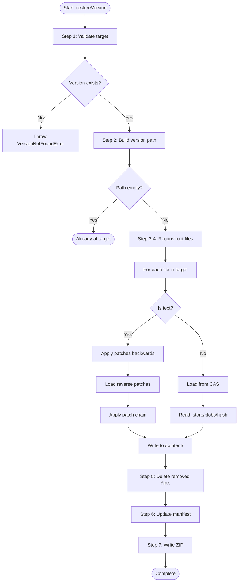

# Restore Version Algorithm

> **Algorytm odtwarzania projektu do dowolnej wersji w historii (time-travel)**

[← Back: Save Checkpoint](01-save-checkpoint.md) | [Next: Diff Generation →](03-diff-generation.md)

---

## Overview

Algorytm `restoreVersion` umożliwia "cofnięcie się w czasie" do dowolnej wersji w historii. Dzięki Reverse Delta Strategy:
- HEAD: O(1) - czytaj bezpośrednio z `/content/`
- Starsza wersja: O(n) - aplikuj n patches wstecz

---

## Algorithm Step-by-Step

```
INPUT:
  - targetVersionId: string    // Version to restore to

OUTPUT:
  - void                       // Updates working copy in-place

PRECONDITION:
  - Target version exists in history

POSTCONDITION:
  - Working copy matches target version
  - HEAD pointer updated
  - manifest.json updated
```

### Step 1: Validate Target Version

```typescript
validateTargetVersion(targetVersionId: string): Version {
  const version = this.manifest.versionHistory.find(
    v => v.id === targetVersionId
  );
  
  if (!version) {
    throw new VersionNotFoundError(
      `Version ${targetVersionId} not found in history`
    );
  }
  
  return version;
}
```

---

### Step 2: Build Version Path

**Purpose**: Find path from HEAD to target (backward through parents).

```typescript
buildVersionPath(targetVersionId: string): string[] {
  const currentId = this.manifest.refs.get('head')!;
  
  if (currentId === targetVersionId) {
    return []; // Already at target
  }
  
  const graph = new VersionGraph();
  for (const v of this.manifest.versionHistory) {
    graph.addVersion(v);
  }
  
  // Find path: current → target
  const path = graph.findPath(currentId, targetVersionId);
  
  return path;
}
```

**Example**:
```
History: v1 → v2 → v3 → v4 → v5 (HEAD)

Restore to v2:
Path: [v5, v4, v3, v2]

Apply patches:
  v5 content + patch(v5→v4) = v4 content
  v4 content + patch(v4→v3) = v3 content
  v3 content + patch(v3→v2) = v2 content
```

**Complexity**: O(V) gdzie V = distance between versions

---

### Step 3: Reconstruct Files

#### 3a. Reconstruct Text Files

```typescript
async reconstructTextFile(
  path: string,
  targetVersion: Version,
  pathToTarget: string[]
): Promise<Uint8Array> {
  // Start with HEAD content
  let content = await this.adapter.readFile(`content/${path}`);
  let text = new TextDecoder().decode(content);
  
  // Apply patches backwards
  for (let i = 0; i < pathToTarget.length - 1; i++) {
    const fromVersion = pathToTarget[i];
    const toVersion = pathToTarget[i + 1];
    
    // Load reverse patch: from → to
    const patchPath = `.store/deltas/${fromVersion}_${hashPath(path)}.patch`;
    
    try {
      const patchData = await this.zipReader.readFile(patchPath);
      const patchText = new TextDecoder().decode(patchData);
      
      // Apply patch
      text = await this.deltaManager.applyDelta(text, patchText);
      
      this.emit('restore:progress', {
        file: path,
        version: toVersion,
        percent: ((i + 1) / (pathToTarget.length - 1)) * 100
      });
    } catch (error) {
      // Patch missing - try fuzzy matching or snapshot
      console.warn(`Patch missing for ${path} at ${fromVersion}`, error);
      text = await this.fallbackReconstruction(path, toVersion);
    }
  }
  
  return new TextEncoder().encode(text);
}
```

#### 3b. Reconstruct Binary Files

```typescript
async reconstructBinaryFile(
  path: string,
  targetVersion: Version
): Promise<Uint8Array> {
  const fileState = targetVersion.fileStates.get(path);
  
  if (!fileState || fileState.deleted) {
    throw new Error(`File ${path} does not exist in target version`);
  }
  
  // Binary files use CAS - just read blob by hash
  const hash = fileState.hash!;
  const blobPath = `.store/blobs/${hash}`;
  
  try {
    const content = await this.zipReader.readFile(blobPath);
    
    this.emit('restore:progress', {
      file: path,
      hash,
      size: content.length
    });
    
    return content;
  } catch (error) {
    throw new BlobNotFoundError(
      `Blob ${hash} not found for file ${path}`,
      { cause: error }
    );
  }
}
```

---

### Step 4: Update Working Copy

```typescript
async updateWorkingCopy(
  targetVersion: Version,
  pathToTarget: string[]
): Promise<void> {
  const targetFiles = Array.from(targetVersion.fileStates.keys());
  
  // Reconstruct all files
  for (const path of targetFiles) {
    const fileState = targetVersion.fileStates.get(path)!;
    
    if (fileState.deleted) {
      continue; // Will delete in next step
    }
    
    const fileEntry = this.manifest.fileMap.get(path);
    
    if (fileEntry?.type === 'text') {
      const content = await this.reconstructTextFile(
        path,
        targetVersion,
        pathToTarget
      );
      await this.adapter.writeFile(`content/${path}`, content);
    } else {
      const content = await this.reconstructBinaryFile(path, targetVersion);
      await this.adapter.writeFile(`content/${path}`, content);
    }
  }
}
```

---

### Step 5: Delete Removed Files

```typescript
async deleteRemovedFiles(targetVersion: Version): Promise<void> {
  // Get current files in working copy
  const currentFiles = await this.listWorkingCopyFiles();
  
  // Get files that should exist in target
  const targetFiles = new Set(
    Array.from(targetVersion.fileStates.entries())
      .filter(([_, state]) => !state.deleted)
      .map(([path, _]) => path)
  );
  
  // Delete files that don't exist in target
  for (const path of currentFiles) {
    if (!targetFiles.has(path)) {
      await this.adapter.deleteFile(`content/${path}`);
      
      this.emit('restore:progress', {
        file: path,
        action: 'deleted'
      });
    }
  }
}
```

---

### Step 6: Update Manifest

```typescript
updateManifestAfterRestore(versionId: string): void {
  // Update HEAD pointer
  this.manifest.refs.set('head', versionId);
  
  // Update metadata
  this.manifest.metadata.lastModified = new Date().toISOString();
  
  // Update fileMap to reflect current state
  const version = this.getVersion(versionId)!;
  for (const [path, fileState] of version.fileStates) {
    const fileEntry = this.manifest.fileMap.get(path);
    if (fileEntry && fileState.hash) {
      fileEntry.currentHash = fileState.hash;
      fileEntry.modified = version.timestamp;
    }
  }
}
```

---

### Step 7: Write Changes

```typescript
async persistChanges(): Promise<void> {
  // Save manifest
  await this.manifestRepository.save(this.manifest);
  
  // Rebuild ZIP with new /content/
  await this.rebuildZip();
  
  this.emit('restore:progress', {
    phase: 'finalizing',
    percent: 100
  });
}
```

---

## Complete Algorithm

```typescript
async restoreVersion(targetVersionId: string): Promise<void> {
  const startTime = Date.now();
  
  try {
    this.emit('restore:start', { targetVersionId });
    
    // Step 1: Validate
    this.emit('restore:progress', { phase: 'validating', percent: 5 });
    const targetVersion = this.validateTargetVersion(targetVersionId);
    
    // Step 2: Build path
    this.emit('restore:progress', { phase: 'planning', percent: 10 });
    const pathToTarget = this.buildVersionPath(targetVersionId);
    
    if (pathToTarget.length === 0) {
      console.log('Already at target version');
      return;
    }
    
    // Step 3-4: Reconstruct files
    this.emit('restore:progress', { phase: 'reconstructing', percent: 20 });
    await this.updateWorkingCopy(targetVersion, pathToTarget);
    
    // Step 5: Delete removed files
    this.emit('restore:progress', { phase: 'cleanup', percent: 70 });
    await this.deleteRemovedFiles(targetVersion);
    
    // Step 6: Update manifest
    this.updateManifestAfterRestore(targetVersionId);
    
    // Step 7: Persist
    this.emit('restore:progress', { phase: 'saving', percent: 90 });
    await this.persistChanges();
    
    this.emit('restore:complete', {
      versionId: targetVersionId,
      duration: Date.now() - startTime
    });
    
  } catch (error) {
    this.emit('restore:error', { error });
    await this.rollback();
    throw error;
  }
}
```

---

## Optimization: Snapshots

**Problem**: Restoring v1 from v100 wymaga aplikacji 99 patches → slow

**Solution**: Periodic snapshots

```typescript
class VersionManager {
  private readonly SNAPSHOT_INTERVAL = 10;
  
  async restoreVersion(targetVersionId: string): Promise<void> {
    // Find nearest snapshot
    const snapshot = this.findNearestSnapshot(targetVersionId);
    
    if (snapshot) {
      // Start from snapshot instead of HEAD
      const pathFromSnapshot = this.buildVersionPath(
        snapshot.versionId,
        targetVersionId
      );
      
      if (pathFromSnapshot.length < pathToTarget.length) {
        console.log(`Using snapshot at ${snapshot.versionId}`);
        // Restore from snapshot...
      }
    }
    
    // Normal restoration
    // ...
  }
  
  async saveCheckpoint(message: string): Promise<string> {
    const versionId = await this.createVersion(message);
    
    // Every 10th version, create snapshot
    if (this.manifest.versionHistory.length % this.SNAPSHOT_INTERVAL === 0) {
      await this.createSnapshot(versionId);
    }
    
    return versionId;
  }
}
```

**Trade-off**:
- Pro: Faster restoration for old versions
- Con: More storage (full content snapshots)

---

## Error Handling

### Patch Application Failure

```typescript
try {
  text = await this.deltaManager.applyDelta(text, patchText);
} catch (error) {
  // Try fuzzy matching
  const [result, success] = await this.deltaManager.applyDeltaFuzzy(
    text,
    patchText
  );
  
  if (success) {
    console.warn('Patch applied with fuzzy matching', { path });
    text = result;
  } else {
    throw new PatchApplicationError(
      `Cannot apply patch for ${path}`,
      { cause: error }
    );
  }
}
```

### Blob Missing

```typescript
catch (error) {
  if (error instanceof BlobNotFoundError) {
    // Try to recover from other versions
    const alternateVersion = this.findVersionWithSameHash(hash);
    
    if (alternateVersion) {
      return await this.reconstructBinaryFile(path, alternateVersion);
    }
  }
  
  throw error;
}
```

### Rollback

```typescript
async rollback(): Promise<void> {
  console.error('Restore failed, rolling back...');
  
  // Reload HEAD version
  const headId = this.manifest.refs.get('head')!;
  await this.restoreVersion(headId);
  
  this.emit('restore:rollback');
}
```

---

## Diagram: Restore Version Flow



---

[← Back: Save Checkpoint](01-save-checkpoint.md) | [Next: Diff Generation →](03-diff-generation.md)

