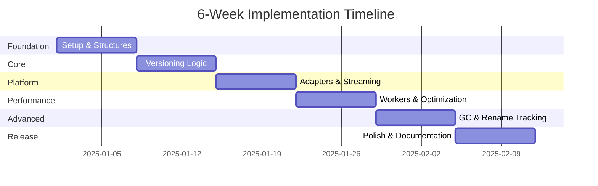

# Implementation Roadmap

> **6-tygodniowy plan implementacji biblioteki JCF Manager**

[← Back: Contributing](05-contributing.md) | [Up to Development](01-setup-environment.md)

---

## Overview

Plan podzielony na 6 faz (tyg od 1), każda kończy się działającym deliverable.



---

## Phase 1: Foundation (Week 1)

### Goals
Zbudować fundament - struktury danych i podstawowe operacje file I/O.

### Tasks

#### Day 1-2: Project Setup
- [ ] Init TypeScript project (`tsconfig.json`, `package.json`)
- [ ] Install dependencies (fflate, diff-match-patch, uuid, vitest)
- [ ] Setup build pipeline (tsup dla dual ESM/CJS)
- [ ] Configure linter (ESLint, Prettier)
- [ ] Setup Git hooks (husky)

```bash
mkdir kamaros
cd kamaros
npm init -y
npm install -D typescript vitest tsup eslint prettier
npm install fflate diff-match-patch uuid
```

#### Day 3-4: Data Structures
- [ ] Define TypeScript interfaces (`src/types/index.ts`)
  - Manifest, Version, FileEntry, FileState
  - JCFConfig, JCFOptions
- [ ] Implement Manifest serialization/deserialization
- [ ] Unit tests dla structures

#### Day 5-6: Adapter Pattern
- [ ] Create `FileSystemAdapter` interface
- [ ] Implement `MemoryAdapter` (for testing)
- [ ] Basic ZIP operations wrapper (`src/core/zip/`)
  - ZipWriter, ZipReader using fflate

#### Day 7: Basic File Operations
- [ ] `addFile()` - add file to working copy
- [ ] `getFile()` - read file from working copy
- [ ] `listFiles()` - list all files
- [ ] Integration tests

### Deliverable
✅ Można dodawać/pobierać pliki w pamięci (bez wersjonowania)

---

## Phase 2: Versioning Core (Week 2)

### Goals
Implementacja save/restore z reverse delta.

### Tasks

#### Day 1-2: Delta Manager
- [ ] Integrate diff-match-patch
- [ ] `computeDelta(oldText, newText): string`
- [ ] `applyDelta(text, patch): string`
- [ ] `saveDelta()`, `loadDelta()`
- [ ] Unit tests with various text samples

#### Day 3-4: Blob Manager
- [ ] SHA-256 hashing (WebCrypto wrapper)
- [ ] `saveBlob(content): string` (returns hash)
- [ ] `loadBlob(hash): Uint8Array`
- [ ] `blobExists(hash): boolean`
- [ ] Content Addressable Storage implementation
- [ ] Unit tests

#### Day 5-6: Version Manager
- [ ] `saveCheckpoint(message)` - basic version
  - Identify changed files
  - Process text files (reverse delta)
  - Process binary files (CAS)
  - Create Version object
  - Update manifest
- [ ] `restoreVersion(versionId)` - basic version
  - Build version path
  - Reconstruct text files (apply patches)
  - Reconstruct binary files (CAS lookup)
- [ ] Integration tests

#### Day 7: Polish
- [ ] Error handling
- [ ] Edge cases (empty files, large files)
- [ ] Performance tests

### Deliverable
✅ Działający save/restore z reverse delta

---

## Phase 3: Platform Adapters (Week 3)

### Goals
Wsparcie dla Browser, Node.js, Tauri + streaming.

### Tasks

#### Day 1-2: Browser Adapter
- [ ] IndexedDB implementation
- [ ] File API integration
- [ ] Blob/File handling
- [ ] Browser-specific tests (Playwright)

#### Day 3: Node.js Adapter
- [ ] fs/promises implementation
- [ ] Path handling
- [ ] Node-specific tests

#### Day 4: Tauri Adapter
- [ ] @tauri-apps/api/fs integration
- [ ] Tauri-specific tests

#### Day 5-6: Streaming Support
- [ ] `getFileStream()` for large files
- [ ] Streaming ZIP read/write
- [ ] Streaming hash (hash-wasm for >50MB)
- [ ] Memory usage tests

#### Day 7: Integration
- [ ] Cross-platform testing
- [ ] CI/CD setup (GitHub Actions)
- [ ] Documentation update

### Deliverable
✅ Działa na Browser, Node.js, Tauri + obsługa dużych plików

---

## Phase 4: Performance (Week 4)

### Goals
Optymalizacja dla production use.

### Tasks

#### Day 1-2: Worker Pool
- [ ] hash-worker.ts (SHA-256 offload)
- [ ] diff-worker.ts (diff-match-patch offload)
- [ ] WorkerPool class (queue management)
- [ ] Tests (ensure correctness)

#### Day 3: LRU Cache
- [ ] Implement LRUCache class
- [ ] Integrate with BlobManager
- [ ] Benchmark (hit rate, performance)

#### Day 4: Parallel Operations
- [ ] Parallel file hashing during save
- [ ] Parallel file reconstruction during restore
- [ ] Benchmarks

#### Day 5-6: Benchmarking
- [ ] Create benchmark suite
  - Small project (100 files, 10MB)
  - Medium project (1000 files, 100MB)
  - Large project (10000 files, 500MB)
- [ ] Profile and optimize hotspots
- [ ] Document performance characteristics

#### Day 7: Polish
- [ ] Memory profiling
- [ ] Fix memory leaks
- [ ] Optimization documentation

### Deliverable
✅ Obsługa plików >500MB, wielowątkowe operacje

---

## Phase 5: Advanced Features (Week 5)

### Goals
GC, rename tracking, verification.

### Tasks

#### Day 1-2: Garbage Collection
- [ ] Mark phase (identify used blobs/deltas)
- [ ] Sweep phase (find orphans)
- [ ] Delete phase (remove orphans)
- [ ] Compact phase (repack ZIP)
- [ ] `runGC(options)` with reporting
- [ ] Tests

#### Day 2-3: File Rename Tracking
- [ ] Inode system (unique IDs)
- [ ] `moveFile(oldPath, newPath)`
- [ ] Rename log
- [ ] `getFileHistory(path)` with renames
- [ ] Tests

#### Day 4: Verification System
- [ ] `verify()` - check integrity
  - Manifest validation
  - Blob hash verification
  - Delta consistency
- [ ] Repair mode (if possible)
- [ ] Tests

#### Day 5-6: Export/Import
- [ ] `export()` - full project as stream
- [ ] `exportSnapshot()` - single version without history
- [ ] `import()` - load from stream/buffer
- [ ] Tests

#### Day 7: Event Emitters
- [ ] Progress events dla wszystkich long-running ops
- [ ] Error events
- [ ] Documentation + examples

### Deliverable
✅ Production-ready library z advanced features

---

## Phase 6: Polish & Release (Week 6)

### Goals
Dokumentacja, testy, release v1.0.0.

### Tasks

#### Day 1-2: API Documentation
- [ ] JSDoc dla wszystkich public methods
- [ ] Generate API docs (TypeDoc)
- [ ] Usage examples
- [ ] README.md

#### Day 3: E2E Tests
- [ ] Real-world scenarios
  - Code editor simulation
  - Large file handling
  - Error recovery
- [ ] Performance regression tests

#### Day 4: Error Handling
- [ ] Review all error paths
- [ ] Add descriptive error messages
- [ ] Error recovery strategies
- [ ] Documentation

#### Day 5: Performance Profiling
- [ ] Final benchmarks
- [ ] Comparison with alternatives (if applicable)
- [ ] Performance guide

#### Day 6: Prepare Release
- [ ] Bump version to 1.0.0
- [ ] CHANGELOG.md
- [ ] Migration guide (dla future versions)
- [ ] License (MIT)
- [ ] Build bundles (ESM, CJS, UMD)

#### Day 7: Release!
- [ ] npm publish
- [ ] GitHub release
- [ ] Announcement (blog post, Twitter, Reddit)
- [ ] Monitor for issues

### Deliverable
✅ v1.0.0 release na npm!

---

## Post-Release Roadmap (v2.0)

### Future Features
- [ ] Branching support
- [ ] Merge conflict resolution
- [ ] Encryption layer
- [ ] CLI tool (`kamaros` command)
- [ ] Real-time collaboration (with sync layer)
- [ ] Python bindings (PyO3)
- [ ] Rust core (WASM for JS)

---

## Success Metrics

### v1.0 Goals
- ✅ 100% test coverage dla core logic
- ✅ Obsługa plików >500MB
- ✅ < 10ms dla common operations (addFile, getFile)
- ✅ < 5s dla saveCheckpoint (100 files changed)
- ✅ Works in Browser, Node, Tauri
- ✅ Bundle size < 50KB (min+gzip)

### v2.0 Goals
- ✅ Branching + merge
- ✅ Rust core (5-10x performance improvement)
- ✅ Multi-language support (JS, Python, etc.)

---

## Team & Resources

### Recommended Team
- **1 Senior Dev** (architecture, code review)
- **1-2 Mid Dev** (implementation)
- **1 Tester** (QA, E2E tests)

### Time Commitment
- ~40 hours/week per developer
- Total: ~240 hours (6 weeks × 40h)

---

[← Back: Contributing](05-contributing.md) | [Up to Development](01-setup-environment.md)

