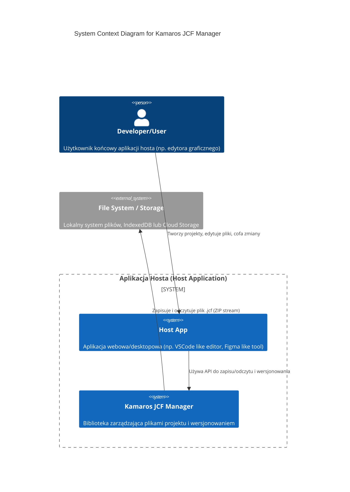
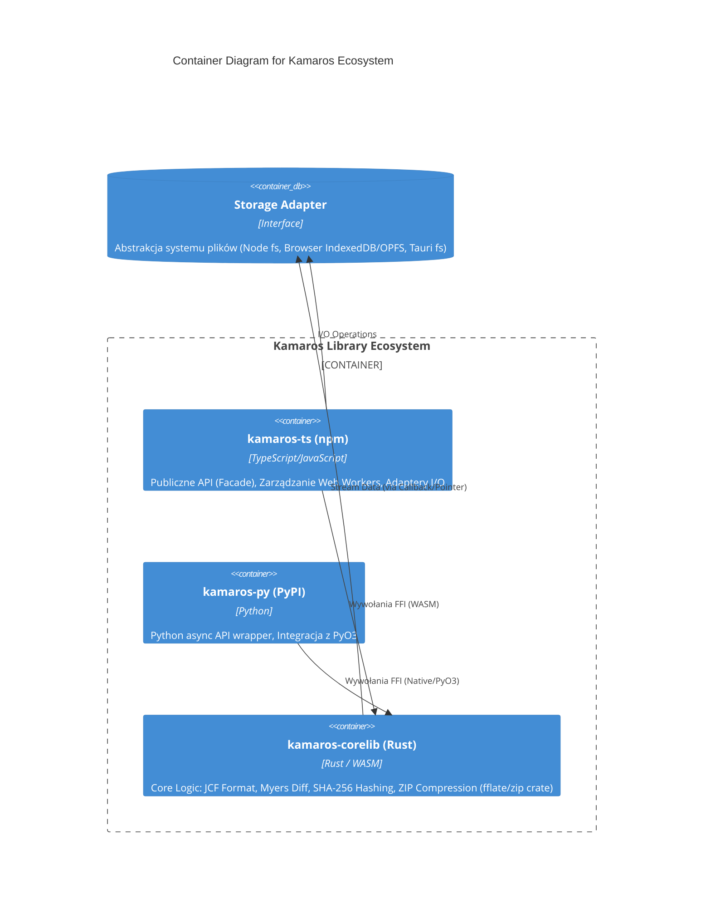

# SPECYFIKACJA ARCHITEKTONICZNA I OPERACYJNA: KAMAROS JCF MANAGER

**Data:** 15.01.2026
**Wersja:** 1.0.0
**Status:** DRAFT
**Autor:** Principal Software Architect (AI)

---

## 1. INŻYNIERIA WYMAGAŃ I ANALIZA LUK

### Cel Biznesowy
Stworzenie **Kamaros JCF Manager** – biblioteki "core" oraz ekosystemu narzędzi umożliwiających aplikacjom webowym (SaaS, edytory offline-first) zarządzanie projektami z pełną historią wersji (Time-Travel) w sposób wydajny (streaming, deduplikacja), niezależny od platformy (Browser/Node/Tauri) i bez konieczności utrzymywania dedykowanego serwera Git. Kamaros ma wypełnić niszę między prostymi plikami ZIP a złożonym Gitem, oferując natywne wsparcie dla dużych plików binarnych.

### Analiza Luk (Gap Analysis)
Na podstawie dostarczonej dokumentacji zidentyfikowano następujące braki informacyjne. Przyjęto **Rozsądne Założenia Rynkowe [ZAŁOŻENIE]**:

| Obszar | Brakująca Informacja | Przyjęte Założenie [ZAŁOŻENIE] | Ryzyko |
|--------|----------------------|--------------------------------|--------|
| **Skala Użycia** | Brak szacunków dot. rozmiaru plików projektów użytkowników końcowych. | Max rozmiar projektu: 2GB. Max plik binarny: 1GB. Ilość wersji: do 1000. | Performance degraduje przy ekstremalnie dużych projektach. |
| **Concurrency** | Brak specyfikacji zachowania przy równoczesnym dostępie (np. multi-tab). | Zastosowanie `navigator.locks` (Web Locks API) lub file levellocking w Node.js. | Race conditions przy braku blokad. |
| **Security** | Brak modelu zagrożeń dla plików pobranych z niezaufanych źródeł (JCF jako wektor ataku). | Biblioteka waliduje strukturę ZIP, ale nie skanuje zawartości plików (odpowiedzialność aplikacji hosta). | ZIP Bombs, Path Traversal (mitygowane w architekturze). |
| **Kompatybilność** | Brak listy wspieranych przeglądarek. | Evergreen Browsers (Chrome, FF, Safari, Edge) z obsługą `ReadableStream` i `WebAssembly`. | Brak wsparcia dla IE11 / starszych mobilnych. |

### Wymagania Funkcjonalne
1.  **Save Checkpoint:** Atomowy zapis stanu projektu (tekst i binaria) jako nowej wersji w historii.
2.  **Restore Version:** Przywrócenie stanu katalogu roboczego (`/content`) do dowolnej wersji z przeszłości (Time-Travel).
3.  **Streaming I/O:** Obsługa odczytu i zapisu plików >500MB bez ładowania całości do RAM.
4.  **Deduplikacja (CAS):** Automatyczne wykrywanie duplikatów binarnych (SHA-256) i przechowywanie ich jako pojedynczych blobów.
5.  **Interoperacyjność:** Możliwość otwarcia pliku `.jcf` w standardowym narzędziu do archiwizacji ZIP.

### Wymagania Niefunkcjonalne (NFR - ISO 25010)

*   **Wydajność (Time Behaviour):**
    *   **Cold Start:** Inicjalizacja biblioteki JCF Manager < 200ms.
    *   **Checkpoint Latency:** Zapis nowej wersji (przyrostowo, małe zmiany) < 500ms (dla projektu < 100MB).
    *   **Restore Latency:** Przywrócenie wersji sprzed 10 commitów < 1s.
*   **Efektywność Zasobów (Resource Utilization):**
    *   **Memory Footprint:** Stałe zużycie pamięci RAM dla operacji strumieniowych (max chunk buffer size * concurrency, ok. 50-100MB) niezależnie od rozmiaru pliku.
*   **Przenośność (Portability):**
    *   Kod `kamaros-corelib` kompilowalny do WASM (Browser/Node) oraz Native (Python extension).
    *   API TypeScript spójne między Browser i Node (Isomorphic).
*   **Niezawodność (Reliability):**
    *   **Atomowość:** Operacja zapisu checkpointu musi być atomowa (wszystko albo nic), aby nie uszkodzić pliku `.jcf`.

---

## 2. ARCHITEKTURA SYSTEMU (MODEL C4)

### Diagram Kontekstu (Context Diagram)

System Kamaros jest biblioteką osadzoną w aplikacji hosta.



### Diagram Kontenerów (Container Diagram)

W przypadku biblioteki "kontenerami" są główne moduły (paczki) i warstwy wykonawcze.



### Stack Technologiczny

| Kontener / Moduł | Technologia | Decyzja (Trade-off Analysis) |
| :--- | :--- | :--- |
| **Core Logic** | **Rust** | **Why:** Bezpieczeństwo pamięci, wydajność bliska C++, doskonałe wsparcie dla WASM. <br> **Trade-off:** Wyższy próg wejścia niż TS, konieczność obsługi FFI. |
| **JS Runtime** | **WebAssembly (WASM)** | **Why:** Umożliwia uruchomienie kodu Rust w przeglądarce z wydajnością bliską natywnej. Jedyny wybór dla heavy-computation w webie. |
| **Compression** | **fflate (TS) / zip (Rust)** | **Why:** `fflate` w JS jest najszybsze i wspiera streaming. W Rust crate `zip`. Hybrydowe podejście lub pełne przejście na Rust (docelowo). |
| **Hashing** | **WebCrypto / Ring (Rust)** | **Why:** WebCrypto w JS jest natywne i szybkie. W Rust `ring` lub `sha2`. Unikanie implementacji pure-JS (wolne). |
| **API Interface** | **TypeScript** | **Why:** Standard w ekosystemie JS. Zapewnia type-safety dla użytkownika biblioteki. |

---

## 3. PERSPEKTYWA SOFTWARE ENGINEERA (IMPLEMENTACJA)

### Struktura Projektu (Clean Architecture)

Drzewo katalogów dla repozytorium typu Monorepo, separujące implementacje językowe od wspólnego jądra.

```text
kamaros/
├── core/                          <-- [Rust] Domena i logika biznesowa (Clean Core)
├── wasm/                          <-- [Rust→WASM] Bindings dla JavaScript
│   └── pkg/                       <-- Output wasm-pack
├── packages/                      <-- [NPM Workspaces] Monorepo JS/TS
│   ├── @kamaros/core-wasm/        <-- Wrapper na build WASM (isomorphic)
│   ├── @kamaros/web/              <-- Adaptery przeglądarkowe (OPFS, IDB)
│   └── @kamaros/node/             <-- Adaptery Node.js (fs)
├── python/                        <-- [Python] PyO3 bindings
├── examples/                      <-- Przykłady użycia (Python, JS, Core)
└── docs/                          <-- Dokumentacja
```

### 3.2. Kluczowe Decyzje Projektowe (ADR)

#### ADR-003: Portable Export (Przenośność Archiwum)
*   **Status:** ZAAKCEPTOWANY
*   **Kontekst:** Domyślny zapis `.jcf` zawiera tylko manifest i snapshot plików, polegając na zewnętrznym store (`.store/`) dla historii. Uniemożliwia to łatwe przenoszenie projektów między maszynami.
*   **Decyzja:** Implementacja trybu **Portable Export** w metodzie `save`. Archiwum wynikowe zawiera rekurencyjnie katalog `.store/blobs/`. Metoda `load` automatycznie wykrywa i importuje te bloby do lokalnego storage'u.
*   **Konsekwencje:**
    *   (+) Pełna przenośność pliku pojedynczego `.jcf`.
    *   (-) Większy rozmiar pliku wyjściowego (zawiera historię).

**Uwaga architektoniczna**: Osobny crate `wasm/` zamiast wasm-bindgen w `core/` zapewnia:
- Core testowalny bez WASM (`cargo test`)
- Czystą separację warstw
- Gotowość na PyO3 bindings (osobny crate, bez konfliktów)
```

### Kluczowe Decyzje Projektowe (ADR)

#### ADR-001: Wybór Strategii Wersjonowania: Reverse Delta
*   **Status:** ZAAKCEPTOWANY
*   **Kontekst:** Systemy kontroli wersji mogą przechowywać pełne snapshoty (szybki odczyt, duży rozmiar) lub delty (mały rozmiar, wolny odczyt).
*   **Decyzja:** Zastosowanie **Reverse Delta**. Aktualna wersja (HEAD) jest zawsze pełnym snapshotem (RAW). Poprzednie wersje są rekonstruowane przez aplikowanie patchy wstecz.
*   **Konsekwencje:**
    *   (+) Natychmiastowy dostęp do najczęściej używanej wersji (HEAD).
    *   (+) Optymalizacja pod "codzienną pracę" (save/load current).
    *   (-) Wolniejszy dostęp do bardzo starej historii (wymaga aplikowania łańcucha patchy).
    *   (-) Konieczność implementacji solidnego algorytmu diff/patch (Myers).

#### ADR-002: Separacja Metadanych Blobów (Opcja C - Index)
*   **Status:** ZAAKCEPTOWANY
*   **Kontekst:** Bloby binarne (CAS) potrzebują metadanych (mimeType, originalName), ale `manifest.json` nie powinien rosnąć w nieskończoność.
*   **Decyzja:** Przechowywanie metadanych blobów w dedykowanym pliku `.store/blobs/index.json`.
*   **Konsekwencje:**
    *   (+) `manifest.json` pozostaje mały i szybki do parsowania przy starcie.
    *   (+) Możliwość lazy-loadingu metadanych blobów tylko gdy potrzebne (np. w przeglądarce plików).
    *   (-) Konieczność synchronizacji zapisu (atomowość) między dodaniem bloba a aktualizacją indeksu.

### Specyfikacja API (Przykłady)

**1. Zapis punktu przywracania (Checkpoint)**
*   **Metoda:** `JCFManager.saveCheckpoint(message: string, options?: SaveOptions): Promise<string>`
*   **Opis:** Tworzy nową wersję (commit).
*   **Payload (Input):**
    ```json
    {
      "message": "Dodano nowe logo i poprawiono style",
      "author": { "name": "Dev", "email": "dev@example.com" }
    }
    ```
*   **Return:** `versionId` (UUID v4)

**2. Dodanie dużego pliku (Streaming)**
*   **Metoda:** `JCFManager.addFile(path: string, content: ReadableStream): Promise<void>`
*   **Opis:** Dodaje plik do staging area streamując dane.
*   **Użycie:** `await manager.addFile('video.mp4', fileHandle.stream());`

**3. Pobranie historii**
*   **Metoda:** `JCFManager.getHistory(limit?: number): Promise<Version[]>`
*   **Opis:** Zwraca listę wersji (graf DAG spłaszczony topologicznie).

---

## 4. GOTOWOŚĆ OPERACYJNA (PRODUCTION READINESS)

### Strategia Wdrożenia (CI/CD)

Ponieważ jest to biblioteka, "wdrożenie" oznacza publikację paczek do rejestrów.

1.  **Build Stage:**
    *   Rust: `cargo build --release --target warn-unknown-unknown`
    *   TS: `npm run build` (tsc + bundler)
2.  **Test Stage:**
    *   Unit Tests (Rust): `cargo test`
    *   Integration Tests (JS): `vitest` uruchamiający scenariusze w Node i JSDOM.
    *   E2E Tests: Playwright uruchamiający prostą aplikację demo używającą biblioteki.
3.  **Security Scan:**
    *   `cargo audit` (zależności Rust)
    *   `npm audit` (zależności JS)
    *   SAST analysis (np. SonarQube).
4.  **Publish Stage:**
    *   Automatyczne wersjonowanie (Semantic Versioning).
    *   Push do `npm` i `PyPI` tylko po przejściu wszystkich testów na branchu `main`.

### Obserwowalność (Observability) - "Złote Sygnały"

Biblioteka powinna emitować zdarzenia (Events) lub metryki, które aplikacja hosta może zbierać.

*   **Latency:** Czas trwania operacji `saveCheckpoint` i `restoreVersion`. (Krytyczne dla UX).
*   **Errors:** Liczba błędów `IntegrityError` (uszkodzony ZIP/Hash mismatch) oraz `IOError`.
*   **Saturation:** Zużycie pamięci (jeśli możliwe do zmierzenia) oraz rozmiar kolejki Web Workerów.
*   **Traffic:** Rozmiar przetwarzanych plików (input bytes) i rozmiar wynikowego pliku JCF.

### Plan Utrzymania

*   **Backup Strategy:** Biblioteka jest narzędziem *do* backupu, ale sama nie robi backupu pliku `.jcf`. Zalecenie dla aplikacji hosta: Zawsze wykonuj kopię pliku `.jcf` przed operacją `saveCheckpoint` (copy-on-write) w systemie plików użytkownika, jeśli to możliwe, aby zapobiec utracie danych w przypadku awarii zasilania w trakcie zapisu.
*   **Aktualizacje:** Biblioteka musi obsługiwać **Schema Evolution**. Jeśli format `jcf` zmieni się w wersji 2.0, biblioteka w wersji 2.0 musi umieć otworzyć i migrować plik z wersji 1.0 (Backward Compatibility).

---

*Dokument wygenerowany automatycznie przez System Architekta AI.*
