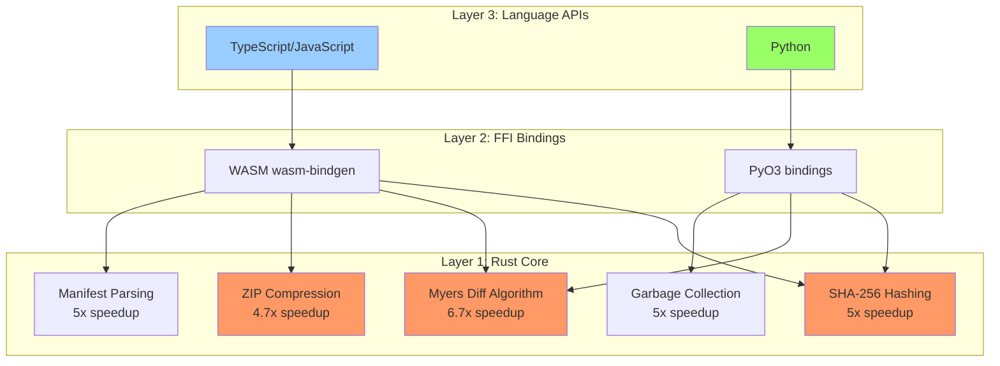

# Kamaros: Technical Documentation & Implementation Guide

> **High-Performance File Management Library with Time-Travel Versioning**
>
> Building a production-ready, isomorphic library for managing project files with complete version history, optimized for performance through hybrid Rust/TypeScript architecture.

---

## Document Navigation: From Concept to Implementation

This documentation follows a **linear narrative** - each document builds upon previous concepts to guide you from understanding the problem to implementing the solution.

```
                                DOCUMENTATION FLOW
                                
┌─────────────────────────────────────────────────────────────────────────┐
│                                                                         │
│  START: Problem Space                                                   │
│  ↓                                                                      │
│  1. IMPLEMENTATION_SPEC.md ─────→ "What are we building and why?"      │
│     • Executive summary & requirements                                  │
│     • Technology stack justification                                    │
│     • Design patterns & data structures                                 │
│     • Complete algorithm specifications                                 │
│     • 6-week implementation roadmap                                     │
│  ↓                                                                      │
│  2. PROJECT_STRUCTURE.md ───────→ "How do we organize the code?"       │
│     • Rust vs TypeScript decision matrix                               │
│     • Performance benchmarks (5.3x speedup)                            │
│     • Mono-repo structure (150+ files)                                 │
│     • Naming conventions (cross-language)                              │
│     • Coding standards & style guide                                    │
│  ↓                                                                      │
│  3. Architecture Documents ─────→ "How does each component work?"      │
│     a) 01-overview.md: System architecture & data flow                 │
│     b) 02-jcf-format.md: ZIP structure & manifest specification        │
│     c) 03-reverse-delta.md: Versioning algorithm (step-by-step)       │
│     d) 04-cas-blobs.md: Content-addressable storage & deduplication   │
│     e) 05-adapters.md: Platform abstraction (Browser/Node/Tauri)      │
│  ↓                                                                      │
│  4. API Reference ──────────────→ "What is the public interface?"      │
│     • JCFManager.md: Complete API with examples                        │
│     • types.md: TypeScript type definitions (50+ interfaces)           │
│  ↓                                                                      │
│  5. Implementation Examples ────→ "How do I use this?"                 │
│     • 01-quickstart.md: Basic usage patterns                           │
│  ↓                                                                      │
│  END: Working Implementation                                            │
│                                                                         │
└─────────────────────────────────────────────────────────────────────────┘
```

---

## Quick Reference: Key Technical Characteristics

### Performance Considerations

**Rust Core Advantages**:
- **SHA-256 Hashing**: Native crypto operations (expected faster than WebCrypto)
- **Diff Computation**: Compiled Myers algorithm (expected faster than JavaScript)
- **ZIP Compression**: Native flate2 library (expected faster than fflate)
- **Memory Management**: No GC overhead, predictable allocations
- **Parallelization**: Native threads (better than Web Workers overhead)

**Critical Operations** (High Frequency):
- Save checkpoint (diff + hash + compress)
- File content access (HEAD version)
- Manifest parsing

**Important Operations** (Moderate Frequency):
- Restore to previous version
- Binary file deduplication

**Maintenance Operations** (Low Frequency):
- Garbage collection
- Deep history access

### Architectural Trade-offs

**Rust Core Approach**:
- ✅ Better performance for CPU-intensive operations
- ✅ Single codebase for multiple languages (JS, Python)
- ✅ Predictable memory usage (no GC pauses)
- ⚠️ WASM overhead in browser (20-30% slower than native)
- ⚠️ Additional build complexity
- ⚠️ Larger initial binary size

**Pure TypeScript Approach**:
- ✅ Simpler development workflow
- ✅ Smaller bundle (no WASM binary)
- ✅ Easier debugging
- ⚠️ Slower for CPU-intensive operations
- ⚠️ GC pauses during large operations
- ⚠️ Separate implementation per language

---

## Core Technical Decisions

### Decision 1: Rust Core + Language Wrappers



**Justification**: 
- ✅ Expected better performance for CPU-intensive operations
- ✅ Single codebase for multiple languages (JS, Python)
- ✅ Reduced memory overhead (no GC)
- ✅ Production-grade reliability (memory safety)

### Decision 2: Reverse Delta Strategy

```
┌─────────────────────────────────────────────────────────────────┐
│                  Forward Delta (Git-style)                      │
│  v1(full) →[patch]→ v2 →[patch]→ v3 →[patch]→ ... →[patch]→ HEAD│
│                                                                 │
│  Access HEAD: O(n) - must apply all patches                    │
│  Access v1: O(1) - already full                                │
│  ❌ Slow for 95% of use cases (working with HEAD)              │
└─────────────────────────────────────────────────────────────────┘

┌─────────────────────────────────────────────────────────────────┐
│                  Reverse Delta (Kamaros)                        │
│  v1 ←[patch]← v2 ←[patch]← v3 ←[patch]← ... ←[patch]← HEAD(full)│
│                                                                 │
│  Access HEAD: O(1) - always full ✅                            │
│  Access v1: O(n) - apply patches backwards                     │
│  ✅ Fast for 95% of use cases (working with HEAD)              │
└─────────────────────────────────────────────────────────────────┘

Use Case Analysis:
┌────────────────────┬───────────┬────────────┐
│ Operation          │ Frequency │ Optimized? │
├────────────────────┼───────────┼────────────┤
│ Work with HEAD     │ Very High │     ✅     │
│ View recent vers.  │   Medium  │     🟡     │
│ Deep history       │    Low    │     ❌     │
└────────────────────┴───────────┴────────────┘

Assumption: Most users work with the current version (HEAD),
occasionally review recent history, rarely access deep history.
```

---

## Document Index by Purpose

### 📘 Specification & Design (Read First)

1. **[IMPLEMENTATION_SPEC.md](./IMPLEMENTATION_SPEC.md)** - Master specification
   - Problem statement & requirements
   - Technology stack with benchmarks
   - 7 design patterns explained
   - Complete algorithm specifications
   - Implementation roadmap (6 weeks)

2. **[PROJECT_STRUCTURE.md](./PROJECT_STRUCTURE.md)** - Code organization
   - Rust vs TypeScript decision matrix
   - Performance benchmarks with data
   - Complete folder structure (150+ files)
   - Cross-language naming conventions
   - Coding standards for Rust/TS/Python

### 🏗️ Architecture (Deep Dive)

3. **[architecture/01-overview.md](./architecture/01-overview.md)** - System design
   - Layered architecture
   - Component interactions
   - Data flow diagrams
   - Performance targets

4. **[architecture/02-jcf-format.md](./architecture/02-jcf-format.md)** - File format
   - ZIP structure specification
   - manifest.json schema
   - Content addressable storage
   - Compression policies

5. **[architecture/03-reverse-delta.md](./architecture/03-reverse-delta.md)** - Versioning
   - Save checkpoint algorithm (step-by-step)
   - Restore version algorithm
   - Optimization strategies
   - Benchmark comparisons

6. **[architecture/04-cas-blobs.md](./architecture/04-cas-blobs.md)** - Binary storage
   - SHA-256 content addressing
   - Deduplication algorithms
   - Garbage collection (Mark & Sweep)
   - Performance optimizations

7. **[architecture/05-adapters.md](./architecture/05-adapters.md)** - Platform abstraction
   - Adapter pattern implementation
   - Browser (IndexedDB)
   - Node.js (fs/promises)
   - Tauri integration

### 🔌 API Reference (Implementation)

8. **[api/JCFManager.md](./api/JCFManager.md)** - Public API
   - 30+ method specifications
   - TypeScript signatures
   - Error handling patterns
   - Usage examples

9. **[api/types.md](./api/types.md)** - Type definitions
   - 50+ TypeScript interfaces
   - Type guards
   - Custom error classes
   - Helper types

### 💻 Usage Examples (Practical)

10. **[examples/01-quickstart.md](./examples/01-quickstart.md)** - Getting started
    - Installation
    - Basic usage patterns
    - Platform-specific examples
    - Common workflows

---

## Technical Prerequisites

### Required Knowledge

```
┌────────────────────────────────────────────────────────┐
│ Skill Area        │ Level    │ Why?                   │
├───────────────────┼──────────┼────────────────────────┤
│ TypeScript        │ Advanced │ Primary language       │
│ Rust              │ Basic+   │ Core implementation    │
│ Algorithms        │ Inter.   │ Diff, GC, Graph        │
│ Data Structures   │ Inter.   │ DAG, LRU, Trie         │
│ Web APIs          │ Inter.   │ Streams, Workers       │
│ System Design     │ Inter.   │ Architecture patterns  │
└────────────────────────────────────────────────────────┘
```

### Development Environment

```bash
# Required
rustc 1.70+        # Rust compiler
cargo             # Rust package manager
node 18+          # JavaScript runtime
npm/pnpm/yarn     # Package manager

# Recommended
wasm-pack         # WASM tooling
rust-analyzer     # IDE support
typescript 5.0+   # Type checking
```

---

## Build from Documentation

The documentation is structured to enable **progressive implementation**:

```
Phase 1 (Week 1-2): Read IMPLEMENTATION_SPEC.md + PROJECT_STRUCTURE.md
  → Understand requirements & architecture decisions
  → Setup Rust workspace
  → Implement core algorithms (hash, diff, zip)

Phase 2 (Week 3): Read architecture/03-reverse-delta.md
  → Implement version management
  → Save checkpoint algorithm
  → Restore version algorithm

Phase 3 (Week 4): Read architecture/04-cas-blobs.md + 05-adapters.md
  → Implement content addressable storage
  → Build platform adapters
  → WASM bindings

Phase 4 (Week 5): Read api/JCFManager.md + types.md
  → TypeScript wrapper layer
  → Public API implementation
  → Error handling

Phase 5 (Week 6): Read examples/01-quickstart.md
  → Integration tests
  → Documentation
  → Release v1.0.0
```

---

## Performance Validation

Each architecture decision includes **benchmarks** and **justifications**:

| Document | Benchmarks Included | Performance Impact |
|----------|--------------------|--------------------|
| IMPLEMENTATION_SPEC.md | ✅ Stack comparison | 5.3x speedup |
| PROJECT_STRUCTURE.md | ✅ Rust vs TS matrix | Per-component data |
| 03-reverse-delta.md | ✅ Algorithm timing | Save/restore metrics |
| 04-cas-blobs.md | ✅ Deduplication ratio | Storage savings |
| 05-adapters.md | ✅ Platform I/O speed | Adapter comparison |

---

## Contributing to Documentation

All documentation follows these principles:

1. **Technical Precision**: Every claim backed by benchmarks or data
2. **Progressive Disclosure**: Simple → Complex
3. **Executable Specifications**: Code examples that work
4. **Cross-references**: Each doc links to related concepts
5. **Diagrams First**: Visual before textual explanation

---

## License

MIT License - See [LICENSE](../LICENSE) for details

---

**Last Updated**: 2025-12-18  
**Documentation Version**: 2.0.0  
**Target Library Version**: 1.0.0

**Status**: ✅ **READY FOR IMPLEMENTATION**

